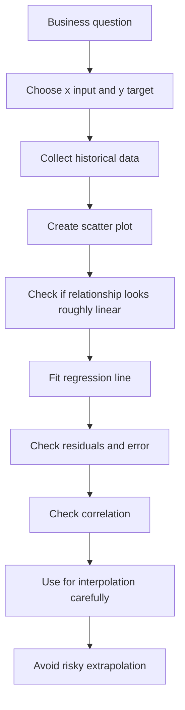
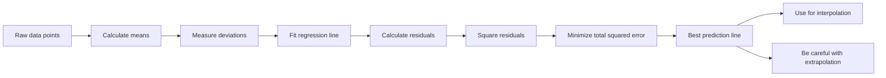

# Linear Regression & Correlation — Easy Study Notes

**Source PDF:** `Haupt_leitfaden03.pdf`  
**Main topic:** *Lineare Regression* — Linear Regression, Least Squares, Correlation, Interpolation, and Extrapolation.

These notes are written in an easy, practical way, with examples from **Data Analytics, BI, Digital Marketing, and Inventory Analytics**.

---

## 0. One Big Picture

Linear regression answers this question:

> “Can I explain or predict one number using another number with a straight line?”

Example from your professional world:

| Business question | x = input | y = output |
|---|---:|---:|
| Does ad spend increase revenue? | Ad spend | Revenue |
| Does website traffic increase conversions? | Sessions | Conversions |
| Does stock level affect sales? | Stock available | Units sold |
| Does discount affect order quantity? | Discount % | Quantity sold |

The model is a straight line:

```math
y = a + bx
```

Where:

- `x` = input
- `y` = actual value
- `a` = intercept / base value
- `b` = slope / effect of x on y
- `a + bx` = predicted value

### Mental picture

```text
Data points are messy.
Regression tries to draw the best straight line through them.

y
↑
|                         ●
|                    ●
|              ●
|         ●
|    ●
+--------------------------------→ x

Best-fit line:
y
↑
|                         ●
|                    ●
|              ●
|        ────────●────────
|    ●
+--------------------------------→ x
```

---

# 1. Sum — `Summe`

## Meaning

A **sum** means adding values.

German: **Summe**  
Math symbol: **Σ** = Sigma

```math
\sum_{i=1}^{n} x_i = x_1 + x_2 + x_3 + \dots + x_n
```

Read this as:

> “Add all x-values from i = 1 to n.”

## Simple example

Suppose you have campaign clicks for 5 days:

| Day | Clicks |
|---:|---:|
| 1 | 100 |
| 2 | 120 |
| 3 | 80 |
| 4 | 150 |
| 5 | 200 |

```math
\sum x_i = 100 + 120 + 80 + 150 + 200 = 650
```

So total clicks = **650**.

## Memory hook

> Σ means “put everything in one basket.”

```text
100 + 120 + 80 + 150 + 200
          ↓
        Σ clicks
          ↓
         650
```

## Why this matters for regression

Linear regression formulas use many sums:

```math
\sum x_i,\quad \sum y_i,\quad \sum x_i y_i,\quad \sum x_i^2
```

You do not need to fear them. They are just repeated additions.

---

# 2. Mittelwert — Mean / Average

## Meaning

German: **Mittelwert**  
English: **mean / average**

The mean is the center of a group of numbers.

```math
\bar{x} = \frac{1}{n}\sum_{i=1}^{n}x_i
```

Read this as:

> “Add all x-values and divide by the number of values.”

## Example

Clicks over 5 days:

```text
100, 120, 80, 150, 200
```

Sum:

```math
100 + 120 + 80 + 150 + 200 = 650
```

Number of days:

```math
n = 5
```

Mean:

```math
\bar{x} = \frac{650}{5} = 130
```

Average clicks = **130 per day**.

## Visual

```text
Values:
80        100     120     150                 200
|----------|-------|-------|-------------------|

Mean:
                 130
                  |
80        100     120  130 150                 200
|----------|-------|----|----|-------------------|
```

## Deep but simple idea from the PDF

The PDF explains that the mean is special because it minimizes the **sum of squared deviations**.

In easy words:

> The mean is the best single “center point” for a group of numbers.

If you choose a point too far left or right, the total squared distance becomes bigger.

```text
Data values:     80   100   120   150   200
Best center:                130
```

## Professional example

If your monthly website sessions are:

```text
Jan: 90k
Feb: 100k
Mar: 110k
Apr: 130k
May: 170k
```

The average tells you the general level of traffic.

But be careful: the mean alone does not show trend. For trend, we use regression.

---

# 3. Abweichung — Deviation

## Meaning

German: **Abweichung**  
English: **deviation**

A deviation is the difference between a value and a reference point.

Most commonly:

```math
x_i - \bar{x}
```

That means:

> “How far is this value from the average?”

## Example

Suppose average clicks = 130.

| Day | Clicks | Deviation from mean |
|---:|---:|---:|
| 1 | 100 | 100 - 130 = -30 |
| 2 | 120 | 120 - 130 = -10 |
| 3 | 80 | 80 - 130 = -50 |
| 4 | 150 | 150 - 130 = +20 |
| 5 | 200 | 200 - 130 = +70 |

## Visual

```text
Mean = 130

80        100     120 130 150                 200
|----------|-------|--|---|--------------------|
-50       -30     -10 0  +20                  +70
```

## Memory hook

> Deviation tells you whether a value is below or above the center.

- Negative deviation = below average
- Positive deviation = above average
- Zero deviation = exactly average

## Business example

If average conversion rate is 3.0%:

| Campaign | Conversion rate | Deviation |
|---|---:|---:|
| Brand Search | 5.0% | +2.0% |
| Display | 1.2% | -1.8% |
| Retargeting | 4.0% | +1.0% |

Deviation helps you quickly see which campaigns are above or below normal.

---

# 4. Residuum — Residual

## Meaning

German: **Residuum**  
English: **residual**

A residual is a prediction error.

In regression:

```math
\text{Residual} = f(x_i) - y_i
```

or sometimes:

```math
\text{Residual} = y_i - f(x_i)
```

Both conventions exist. The important idea is:

> Residual = distance between predicted value and actual value.

## Simple example

Suppose your regression model predicts:

```math
\text{Sales} = 500 + 20 \times \text{Ad Spend}
```

For a campaign where ad spend = 10:

```math
\text{Predicted sales} = 500 + 20 \times 10 = 700
```

Actual sales = 760.

Residual:

```math
760 - 700 = 60
```

The model underpredicted by 60.

## Visual

```text
y
↑
|                    ● actual point
|                    |
|                    | residual
|                    |
|            ────────● predicted point on line
|
+--------------------------------→ x
```

## Memory hook

> Residual = “what the model missed.”

A good model has small residuals.

A bad model has large residuals.

---

# 5. Methode der kleinsten Quadrate — Least Squares Method

## Meaning

German: **Methode der kleinsten Quadrate**  
English: **least squares method**

The goal of linear regression is:

> Find the line that makes the total squared residuals as small as possible.

Formula:

```math
\sum_{i=1}^{n}(f(x_i)-y_i)^2
```

## Why square the residuals?

Because errors can be positive or negative.

If we simply add errors, they may cancel out.

### Bad idea: normal errors

```text
Error 1 = +100
Error 2 = -100

Sum = 0
```

This looks perfect, but the model made two big mistakes.

### Better idea: squared errors

```math
100^2 + (-100)^2 = 10000 + 10000 = 20000
```

Now the model is punished for both mistakes.

## Visual idea

Each residual becomes a square.

```text
Point above line:
        ●
        | residual
        |
────────●──────── line

Squared residual:
        ┌───┐
        │   │
        │   │
────────└───┘──── line
```

The best regression line is the one where the total area of all these squares is smallest.

## Business example

Suppose we predict weekly sales from ad spend.

| Week | Actual sales | Predicted sales | Residual | Squared residual |
|---:|---:|---:|---:|---:|
| 1 | 1000 | 950 | +50 | 2500 |
| 2 | 1200 | 1300 | -100 | 10000 |
| 3 | 1500 | 1480 | +20 | 400 |

Total squared error:

```math
2500 + 10000 + 400 = 12900
```

Least squares tries to find the line that makes this total as small as possible.

## Memory hook

> Least squares = “smallest total mistake after squaring every mistake.”

---

# 6. Ausgleichsgerade — Best-Fit Line

## Meaning

German: **Ausgleichsgerade**  
English: **best-fit line**

This is the straight line that balances the data points as well as possible.

It is called “Ausgleich” because it balances out the errors.

## Visual

```text
Without line:

y
↑
|                      ●
|                 ●
|          ●
|     ●
|  ●
+----------------------------→ x


With best-fit line:

y
↑
|                      ●
|                 ●
|          ●
|     ────────●────────────
|  ●
+----------------------------→ x
```

## Important idea

The best-fit line does not always pass through every point.

It tries to be the best overall compromise.

## Professional example

You may have data:

| Ad spend | Revenue |
|---:|---:|
| 1000 | 7000 |
| 2000 | 9000 |
| 3000 | 13000 |
| 4000 | 13500 |
| 5000 | 17000 |

The points may not form a perfect line because business data is noisy:

- different creatives
- seasonality
- competitors
- stock availability
- discounts
- tracking issues

Regression finds the line that best summarizes the overall trend.

---

# 7. Regressionsgerade — Regression Line

## Meaning

German: **Regressionsgerade**  
English: **regression line**

The regression line is the line used for prediction:

```math
f(x) = a + bx
```

Where:

| Symbol | Meaning | Example |
|---|---|---|
| `x` | input variable | ad spend |
| `f(x)` | predicted value | predicted revenue |
| `a` | intercept | revenue when ad spend is zero |
| `b` | slope | revenue increase per extra ad spend unit |

## Slope and intercept

### Intercept `a`

The intercept is where the line crosses the y-axis.

```text
If x = 0, then y = a
```

Business interpretation:

> Baseline value when the input is zero.

Example:

```math
\text{Revenue} = 5000 + 2.5 \times \text{Ad Spend}
```

Here:

```text
a = 5000
```

This means baseline revenue is 5000 when ad spend is 0.

### Slope `b`

The slope tells how much y changes when x increases by 1.

```text
If b = 2.5, then every +1 in x adds +2.5 to predicted y.
```

Business interpretation:

> Expected change in output per one-unit change in input.

## Regression formula from the PDF

The PDF gives this formula for slope:

```math
b = \frac{\sum x_i y_i - n\bar{x}\bar{y}}{\sum x_i^2 - n\bar{x}^2}
```

Then:

```math
a = \bar{y} - b\bar{x}
```

## Intuitive meaning

```text
b = how x and y move together / how much x varies
```

Or:

```math
b = \frac{\text{covariance of x and y}}{\text{variance of x}}
```

## Memory hook

> Regression line = prediction line.

---

# 8. Worked Example from the PDF

The PDF uses the data points:

| i | x | y |
|---:|---:|---:|
| 1 | 1 | 1 |
| 2 | 2 | 2 |
| 3 | 3 | 2 |

## Step 1: Calculate sums

| i | x | y | xy | x² |
|---:|---:|---:|---:|---:|
| 1 | 1 | 1 | 1 | 1 |
| 2 | 2 | 2 | 4 | 4 |
| 3 | 3 | 2 | 6 | 9 |
| **Total** | **6** | **5** | **11** | **14** |

## Step 2: Calculate means

```math
\bar{x} = \frac{6}{3} = 2
```

```math
\bar{y} = \frac{5}{3}
```

## Step 3: Calculate slope

```math
b = \frac{11 - 3 \cdot 2 \cdot \frac{5}{3}}{14 - 3 \cdot 2^2}
```

```math
b = \frac{11 - 10}{14 - 12}
```

```math
b = \frac{1}{2}
```

## Step 4: Calculate intercept

```math
a = \bar{y} - b\bar{x}
```

```math
a = \frac{5}{3} - \frac{1}{2}\cdot 2
```

```math
a = \frac{5}{3} - 1 = \frac{2}{3}
```

## Final regression line

```math
f(x)=\frac{2}{3}+\frac{1}{2}x
```

## Meaning

For each +1 increase in x, predicted y increases by 0.5.

```text
x = 1 → predicted y = 2/3 + 1/2 = 1.1667
x = 2 → predicted y = 2/3 + 1   = 1.6667
x = 3 → predicted y = 2/3 + 1.5 = 2.1667
```

## Visual

```text
y
↑
3 |
2 |        ●────●
1 |  ●
0 +----------------→ x
    1      2      3

Best-fit line:
f(x) = 2/3 + 1/2x
```

---

# 9. Regression in Machine Learning Language

In ML, linear regression is a simple model.


## BI / Marketing example

You want to predict conversions from website sessions.

| Sessions x | Conversions y |
|---:|---:|
| 1000 | 30 |
| 2000 | 55 |
| 3000 | 80 |
| 4000 | 120 |
| 5000 | 140 |

Regression learns:

```math
\text{Conversions} = a + b \times \text{Sessions}
```

Then you can predict:

```text
If sessions = 6000, expected conversions ≈ ?
```

That is ML-style prediction.

---

# 10. Varianz — Variance

## Meaning

German: **Varianz**  
English: **variance**

Variance measures how spread out values are around the mean.

Formula:

```math
V_x = \frac{1}{n}\sum_{i=1}^{n}(x_i-\bar{x})^2
```

## Simple meaning

> Variance tells how much the values move away from the average.

## Example A: low variance

```text
Daily conversions:
48, 50, 51, 49, 52
```

These are close to the mean.

```text
Low variance = stable performance
```

## Example B: high variance

```text
Daily conversions:
10, 80, 20, 120, 5
```

These are far from the mean.

```text
High variance = unstable performance
```

## Visual

```text
Low variance:
48 49 50 51 52
|--|--|--|--|
      mean

High variance:
5        20            80                 120
|---------|-------------|-------------------|
             mean somewhere in middle
```

## Professional meaning

In marketing:

- Low variance campaign = stable performance
- High variance campaign = volatile performance

In inventory:

- Low variance demand = easy to plan stock
- High variance demand = risk of stockout or overstock

## Memory hook

> Variance = “how scattered are the values?”

---

# 11. Standardabweichung — Standard Deviation

## Meaning

German: **Standardabweichung**  
English: **standard deviation**

Standard deviation is the square root of variance.

```math
s_x = \sqrt{V_x}
```

## Why do we need it?

Variance uses squared units.

Example:

```text
Clicks variance has unit: clicks²
```

That is hard to interpret.

Standard deviation brings it back to original units:

```text
Standard deviation has unit: clicks
```

## Simple meaning

> Standard deviation is the typical distance from the mean.

## Example

Suppose average daily conversions = 100.

If standard deviation = 5:

```text
Most days are around 95 to 105 conversions.
Performance is stable.
```

If standard deviation = 40:

```text
Many days may be around 60 to 140 conversions.
Performance is unstable.
```

## Visual

```text
Small standard deviation:
          ● ● ● ● ●
----------|----------→
         mean

Large standard deviation:
●       ●     ●       ●        ●
----------|----------→
         mean
```

## Memory hook

> Standard deviation = “normal wobble around average.”

---

# 12. Kovarianz — Covariance

## Meaning

German: **Kovarianz**  
English: **covariance**

Covariance measures how two variables move together.

Formula idea:

```math
s_{xy} = \frac{1}{n}\sum_{i=1}^{n}(x_i-\bar{x})(y_i-\bar{y})
```

## Simple meaning

> Covariance checks whether x and y go up/down together.

## How it works

For each data point:

```text
x deviation = xᵢ - x̄
y deviation = yᵢ - ȳ
```

Then multiply them.

| x behavior | y behavior | Product | Meaning |
|---|---|---:|---|
| x above average | y above average | positive | move together |
| x below average | y below average | positive | move together |
| x above average | y below average | negative | move opposite |
| x below average | y above average | negative | move opposite |

## Visual: positive covariance

```text
As x increases, y increases.

y
↑
|              ●
|          ●
|      ●
|   ●
| ●
+--------------------→ x
```

## Visual: negative covariance

```text
As x increases, y decreases.

y
↑
| ●
|   ●
|      ●
|          ●
|              ●
+--------------------→ x
```

## Professional examples

### Positive covariance

```text
More ad spend → more clicks
More website sessions → more conversions
More stock availability → more sales
```

### Negative covariance

```text
Higher price → lower quantity sold
Longer page load time → lower conversion rate
Higher delivery time → lower customer satisfaction
```

## Important limitation

Covariance tells direction, but not standardized strength.

The number can be hard to interpret because it depends on units.

That is why we use correlation.

## Memory hook

> Covariance = “do they move together or opposite?”

---

# 13. Korrelationskoeffizient — Correlation Coefficient

## Meaning

German: **Korrelationskoeffizient**  
English: **correlation coefficient**

Correlation measures the strength and direction of a **linear** relationship.

Formula:

```math
r_{xy} =
\frac{\sum (x_i-\bar{x})(y_i-\bar{y})}
{\sqrt{\sum (x_i-\bar{x})^2}\sqrt{\sum (y_i-\bar{y})^2}}
```

The value is always between:

```math
-1 \le r \le 1
```

## Interpretation

| r value | Meaning |
|---:|---|
| +1.0 | Perfect positive linear relationship |
| +0.8 | Strong positive linear relationship |
| +0.3 | Weak positive linear relationship |
| 0.0 | No linear relationship |
| -0.3 | Weak negative linear relationship |
| -0.8 | Strong negative linear relationship |
| -1.0 | Perfect negative linear relationship |

## Visual guide

```text
r = +1 perfect positive

y
↑
|        ●
|      ●
|    ●
|  ●
|●
+--------------→ x
```

```text
r = -1 perfect negative

y
↑
|●
|  ●
|    ●
|      ●
|        ●
+--------------→ x
```

```text
r ≈ 0 no linear relationship

y
↑
|   ●       ●
|      ●
| ●       ●
|        ●
|    ●
+--------------→ x
```

## Professional example

### Strong positive correlation

```text
Sessions and conversions often have positive correlation.
More sessions usually means more conversions.
```

### Strong negative correlation

```text
Page load time and conversion rate may have negative correlation.
Longer load time usually means fewer conversions.
```

### Weak or zero correlation

```text
Number of dashboard views and actual sales may have weak correlation.
People checking dashboards does not necessarily cause more sales.
```

## Memory hook

> Correlation = “how straight-line related are they?”

---

# 14. Correlation Is Not Causation

This is one of the most important warnings in the PDF.

## Meaning

Two variables can move together without one causing the other.

```text
Correlation = they move together
Causation = one causes the other
```

These are different.

## Example from the PDF style

```text
Number of storks and number of births may be correlated.
But storks do not cause babies.
```

## Business example

Suppose you find:

```text
Dashboard views and revenue are correlated.
```

Does that mean dashboard views cause revenue?

Not necessarily.

Possible explanations:

```text
1. More sales activity causes both more revenue and more dashboard checks.
2. During high season, both dashboard views and revenue increase.
3. Managers check dashboards more when campaigns are running.
```

## Marketing example

```text
Ad spend and sales are correlated.
```

This might mean ads increase sales.

But it could also mean:

```text
Sales season causes company to spend more on ads.
Discount campaign increases both ad spend and sales.
A third factor, like Christmas, drives both.
```

## Memory hook

> Correlation is a clue, not proof.

To prove causation, you usually need:

- experiments
- A/B testing
- randomized testing
- causal analysis
- domain knowledge

---

# 15. `r = 0` Does Not Always Mean “No Relationship”

Another important warning from the PDF:

Correlation measures only **linear** relationship.

It can miss curved relationships.

## Example

Points:

```text
(0,4), (1,1), (2,0), (3,1), (4,4)
```

They follow a parabola:

```math
y = (x-2)^2
```

## Visual

```text
y
↑
4 |●               ●
3 |
2 |
1 |    ●       ●
0 |        ●
  +--------------------→ x
   0    1   2   3    4
```

This is clearly a relationship, but it is not a straight-line relationship.

Correlation may be close to 0.

That means:

```text
No linear relationship
```

Not:

```text
No relationship at all
```

## Professional example

Discount vs profit may be curved:

```text
Small discount → profit increases
Medium discount → profit peaks
Large discount → profit decreases
```

Visual:

```text
Profit
↑
|          ●
|       ●     ●
|    ●           ●
| ●
+--------------------→ Discount
```

A simple correlation may miss this pattern.

## Memory hook

> Correlation sees straight lines, not curves.

---

# 16. Interpolation

## Meaning

German: **Interpolation**  
English: **interpolation**

Interpolation means predicting inside the known range of data.

## Example

Known ad spend values:

```text
1000, 2000, 3000, 4000, 5000
```

Predicting revenue for:

```text
Ad spend = 3500
```

This is interpolation because 3500 is inside the known range.

## Visual

```text
Known range:
1000 ---- 2000 ---- 3000 ---- 4000 ---- 5000

Interpolation:
                         3500 ✅
```

## Why it is safer

The model has already seen nearby data.

So the prediction is more believable.

## Professional example

If you have campaign data for daily budgets between €50 and €500, predicting performance at €300 is interpolation.

That is usually reasonable.

## Memory hook

> Interpolation = prediction between known points.

---

# 17. Extrapolation

## Meaning

German: **Extrapolation**  
English: **extrapolation**

Extrapolation means predicting outside the known data range.

## Example

Known ad spend values:

```text
1000, 2000, 3000, 4000, 5000
```

Predicting revenue for:

```text
Ad spend = 20000
```

This is extrapolation because 20000 is far outside the known range.

## Visual

```text
Known range:
1000 ---- 2000 ---- 3000 ---- 4000 ---- 5000

Extrapolation:
                                                   20000 ⚠️
```

## Why it is risky

The trend may not continue.

Example:

```text
Ad spend increases sales at first.
But after some point, audience saturation happens.
More spend may not create proportional revenue.
```

## Business example

If you have inventory demand data for 100 to 500 units in stock, predicting sales for 5000 units in stock may be dangerous.

## Memory hook

> Extrapolation = prediction beyond known territory.

---

# 18. First and Second Regression Line

The PDF explains an advanced but important idea.

## First regression line

Usually we predict y from x:

```math
y = a + bx
```

Example:

```text
Predict revenue from ad spend.
```

This minimizes vertical errors.

```text
        ● actual
        |
        | vertical error
────────●──────── regression line
```

## Second regression line

Sometimes we predict x from y:

```math
x = a' + b'y
```

Example:

```text
Predict required ad spend from desired revenue.
```

This minimizes horizontal errors.

```text
●──────── actual
 horizontal error
          |
          line
```

## Important point

These two regression lines are usually not the same.

They are the same only when all points lie perfectly on one straight line.

## Professional example

Question A:

```text
Given ad spend, what revenue do we expect?
```

Question B:

```text
Given target revenue, how much ad spend do we need?
```

These sound like opposites, but statistically they are different prediction problems.

## Memory hook

> Best line depends on what you are trying to predict.

---

# 19. Regression Workflow for Your Analytics Work



## Example: Predicting Conversions from Sessions

### Step 1: Business question

```text
Can we predict conversions based on website sessions?
```

### Step 2: Define variables

```text
x = sessions
y = conversions
```

### Step 3: Scatter plot

```text
Conversions
↑
|                       ●
|                  ●
|             ●
|        ●
|   ●
+-----------------------------→ Sessions
```

### Step 4: Fit regression

```math
\text{Conversions} = a + b \times \text{Sessions}
```

### Step 5: Interpret slope

If:

```math
b = 0.025
```

Then:

```text
Every extra 1 session gives 0.025 extra conversions on average.
Every extra 1000 sessions gives about 25 extra conversions.
```

### Step 6: Use carefully

Good use:

```text
Predict conversions for session levels similar to past data.
```

Risky use:

```text
Predict conversions for 10x more traffic than you have ever seen.
```

---

# 20. Concept Table — German to English

| German term | English term | Easy meaning | Memory hook |
|---|---|---|---|
| Summe | Sum | Add values | Put everything in one basket |
| Mittelwert | Mean / average | Center of values | Balance point |
| Abweichung | Deviation | Difference from average/reference | How far from center? |
| Residuum | Residual | Prediction error | What the model missed |
| Methode der kleinsten Quadrate | Least squares method | Minimize squared errors | Smallest total squared mistakes |
| Ausgleichsgerade | Best-fit line | Line that best balances points | Best compromise line |
| Regressionsgerade | Regression line | Prediction line | y = a + bx |
| Varianz | Variance | Spread of values | How scattered? |
| Standardabweichung | Standard deviation | Typical distance from mean | Normal wobble |
| Kovarianz | Covariance | How two variables move together | Together or opposite? |
| Korrelationskoeffizient | Correlation coefficient | Strength of linear relationship | How straight-line related? |
| Interpolation | Interpolation | Predict inside known range | Safer prediction |
| Extrapolation | Extrapolation | Predict outside known range | Risky prediction |

---

# 21. Full Mental Model



## How everything connects

```text
Sum helps calculate the mean.
Mean helps calculate deviations.
Deviations help calculate variance and covariance.
Variance and covariance help calculate slope.
Slope and intercept define the regression line.
Regression line creates predictions.
Predictions create residuals.
Least squares chooses the line with smallest squared residuals.
Correlation tells how strong the linear relationship is.
Interpolation uses the line inside known data.
Extrapolation uses the line outside known data and is risky.
```

---

# 22. Mini Practice Example

You have campaign data:

| Campaign | Ad spend x | Revenue y |
|---|---:|---:|
| A | 100 | 1000 |
| B | 200 | 1500 |
| C | 300 | 1900 |
| D | 400 | 2600 |
| E | 500 | 3000 |

## Questions to ask

1. Does revenue generally increase with ad spend?
2. Is the relationship roughly linear?
3. What is the best-fit line?
4. What is the residual for each campaign?
5. Is predicting revenue at €350 ad spend interpolation or extrapolation?
6. Is predicting revenue at €5000 ad spend interpolation or extrapolation?
7. Does correlation prove ad spend caused the revenue?

## Answers conceptually

1. Yes, revenue increases as ad spend increases.
2. It looks roughly linear.
3. Regression finds the best line.
4. Residual = actual revenue - predicted revenue.
5. €350 is interpolation.
6. €5000 is extrapolation.
7. No. Correlation does not prove causation.

---

# 23. Common Mistakes to Avoid

## Mistake 1: Thinking regression always means causation

Wrong:

```text
Ad spend and revenue correlate, so ad spend caused all revenue.
```

Better:

```text
Ad spend and revenue move together. To prove causation, we need more evidence.
```

## Mistake 2: Trusting extrapolation too much

Wrong:

```text
If €1000 ad spend gives €5000 revenue, then €1,000,000 ad spend gives €5,000,000 revenue.
```

Better:

```text
The trend may break because of saturation, budget limits, market size, or competition.
```

## Mistake 3: Using linear correlation for curved patterns

Wrong:

```text
r = 0, so there is no relationship.
```

Better:

```text
r = 0 means no linear relationship. There may still be a curved relationship.
```

## Mistake 4: Ignoring residuals

Wrong:

```text
I fitted a line, so the model is good.
```

Better:

```text
Check residuals. Large residuals mean the model may not fit well.
```

---

# 24. Final Summary

Linear regression is the foundation of many machine learning ideas.

The most important idea:

> We find a prediction line by minimizing prediction errors.

In one sentence:

```text
Linear regression finds the straight line that best predicts y from x by minimizing the total squared residuals.
```

And the second most important idea:

```text
Correlation tells how strong a linear relationship is, but it does not prove causation.
```

## The complete memory chain

```text
Sum → Mean → Deviation → Variance/Covariance → Slope → Regression line → Prediction → Residual → Least squares → Best-fit line → Correlation → Interpolation/Extrapolation
```

Keep this chain in your head, and the whole PDF becomes much easier.

---

# 25. Ultra-Short Cheat Sheet

```text
Sum:
Add all values.

Mean:
Center of values.

Deviation:
Value minus center.

Residual:
Actual minus predicted.

Least squares:
Choose the line with smallest squared prediction errors.

Best-fit line:
Line that balances all points.

Regression line:
Line used for prediction.

Variance:
Spread of one variable.

Standard deviation:
Typical distance from average.

Covariance:
Whether two variables move together.

Correlation:
Strength of linear relationship from -1 to +1.

Interpolation:
Predict inside known range.

Extrapolation:
Predict outside known range; risky.
```

# 26. More simple explanation

Summe
= add everything

Mittelwert
= find the center

Abweichung
= distance from center

Residuum
= prediction mistake

Least squares
= choose the line with smallest squared mistakes

Ausgleichsgerade
= best line through dots

Regressionsgerade
= line used for prediction

Varianz
= how spread out values are

Standardabweichung
= usual distance from average

Kovarianz
= do two things move together?

Korrelation
= how strong is their straight-line relationship?

Interpolation
= predict inside known area

Extrapolation
= predict outside known area, risky