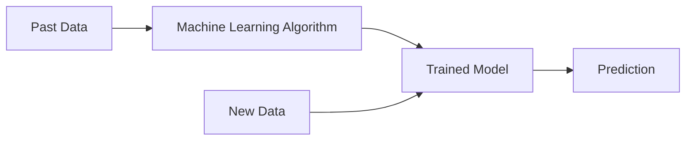
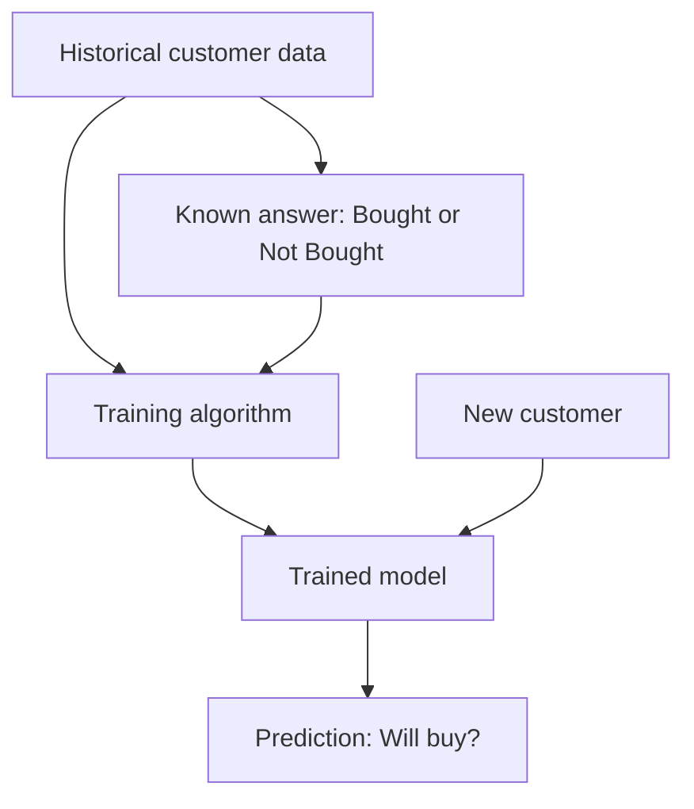
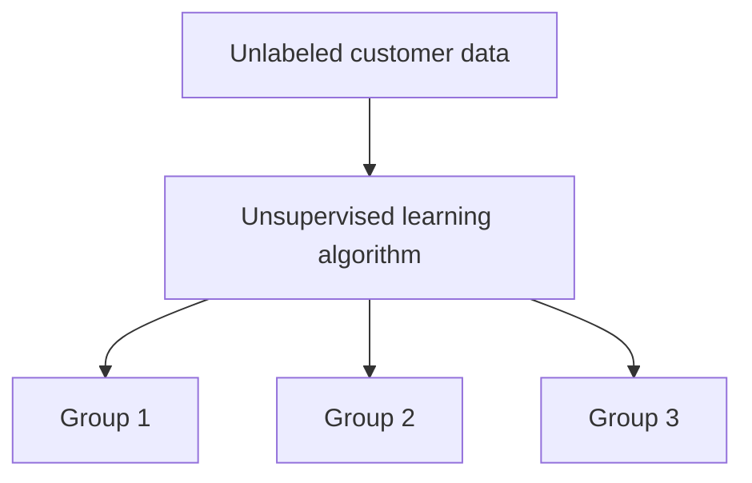
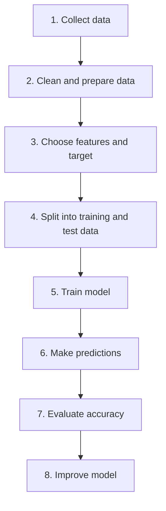
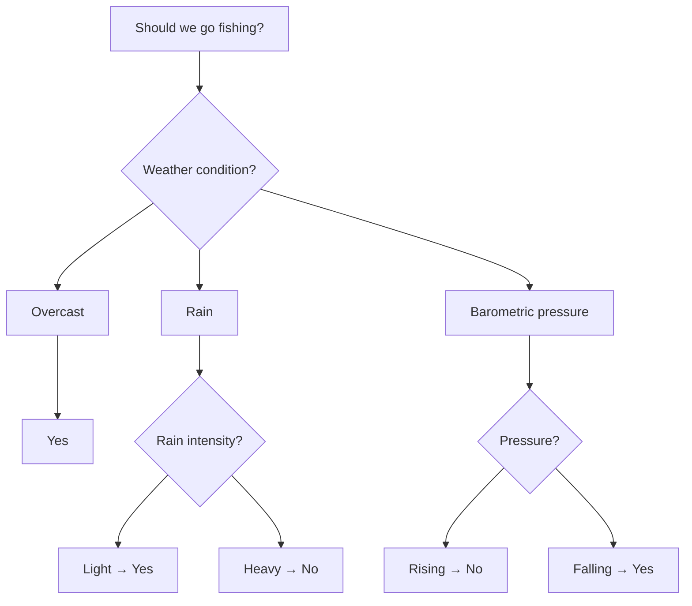
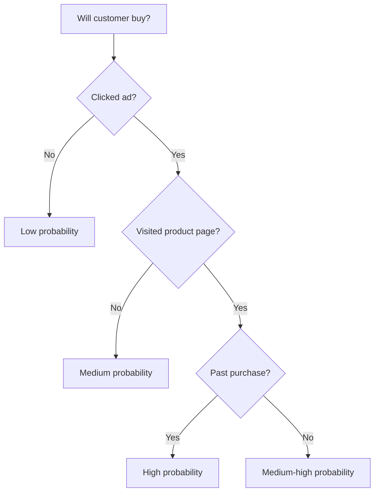
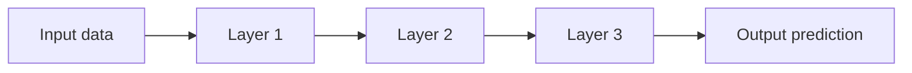
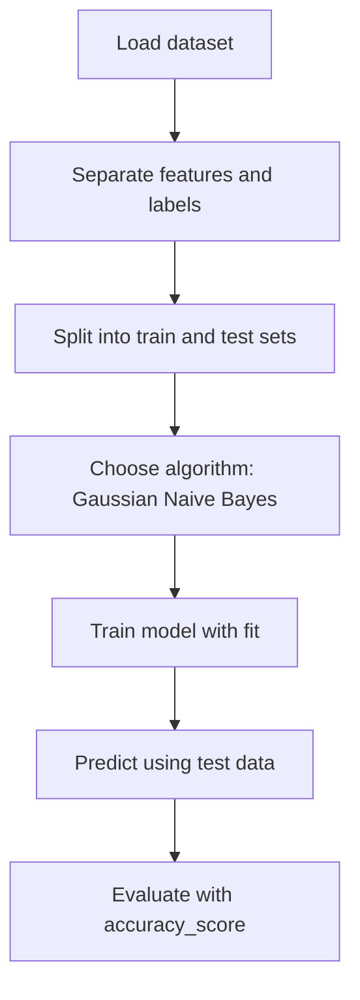

# Machine Learning Day 1 — Easy Notes with Visuals

**Source:** *Python Machine Learning Projects* by DigitalOcean authors.  
**Goal of these notes:** Understand the basic ideas before doing coding.

---

## 1. Big Picture: What is Machine Learning?

Machine Learning means:  
**A computer learns patterns from data and uses those patterns to make predictions or decisions.**

### Traditional Programming vs Machine Learning

```text
Traditional Programming
-----------------------
Rules + Data  →  Program  →  Answer

Example:
If email contains many suspicious words,
then mark it as spam.
```

```text
Machine Learning
----------------
Data + Correct Examples  →  Model learns pattern  →  Predicts answer

Example:
Show the computer many spam and non-spam emails.
It learns what spam usually looks like.
Then it predicts whether a new email is spam.
```

### Visual



**Simple idea:**  
A machine learning model is like a smart formula that learns from examples instead of being fully written by humans.

---

## 2. Why Do We Use Machine Learning?

Machine learning is useful when rules are difficult to write manually.

Examples from the document:

| Use case | What ML does |
|---|---|
| Facial recognition | Identifies people in photos |
| OCR | Converts image text into editable text |
| Recommendation systems | Suggests movies, products, or videos |
| Self-driving cars | Helps cars understand surroundings |

### Examples from your Data / BI / Marketing background

| Business area | Machine Learning use case |
|---|---|
| Digital marketing | Predict which users may convert |
| SEO / SEA | Predict campaign performance |
| Inventory analytics | Forecast stock demand |
| Customer analytics | Group similar customers |
| Fraud detection | Detect unusual transactions |
| Reporting | Automatically classify trends or alerts |

---

## 3. Key ML Vocabulary

These words are very important for Day 1.

| Term | Easy meaning | Example |
|---|---|---|
| **Data** | Information used by the model | Customer records, sales rows, images |
| **Feature** | Input column used for prediction | Age, clicks, revenue, stock level |
| **Label / Target** | The answer we want to predict | Bought: Yes/No, sales amount, tumor type |
| **Model** | The learned pattern | A trained classifier or prediction system |
| **Training** | Teaching the model using past data | Learn from historical customers |
| **Prediction** | Model output for new data | “This customer may buy” |
| **Accuracy** | How often the model is correct | 94% correct predictions |

### Feature and Label visual

```text
Dataset row:
------------------------------------------------------
Customer | Clicks | Time on site | Past purchase | Bought?
------------------------------------------------------
A        |   5    |   10 min     | Yes           | Yes

Features = Clicks, Time on site, Past purchase
Label    = Bought?
```

---

## 4. Main Types of Machine Learning

The document introduces two major types:

1. **Supervised Learning**
2. **Unsupervised Learning**

---

# 4.1 Supervised Learning

Supervised learning means the training data already has the correct answer.

```text
Input data + Correct labels → Model learns → Predicts labels for new data
```

### Example from the document

```text
Image of shark  → label: fish
Image of ocean  → label: water
```

After training, the model can see a new shark image and predict:

```text
fish
```

### Business example

```text
Customer data + Bought/Did not buy labels → Model learns buying pattern
```

Then for a new customer:

```text
New customer → Model predicts: likely to buy / not likely to buy
```

### Visual



### Two common supervised learning tasks

| Task | What it predicts | Example |
|---|---|---|
| **Classification** | A category | Spam / Not spam, Buy / Not buy |
| **Regression** | A number | Sales next month, revenue forecast |

---

# 4.2 Unsupervised Learning

Unsupervised learning means the data does **not** have correct answers or labels.

```text
Input data only → Model finds hidden patterns or groups
```

### Example

You give the model customer purchase data, but you do not tell it customer types.

The model may discover groups like:

```text
Group 1: Discount buyers
Group 2: Premium buyers
Group 3: Seasonal buyers
```

### Visual



### Common unsupervised learning tasks

| Task | Meaning | Example |
|---|---|---|
| **Clustering** | Group similar records | Customer segmentation |
| **Anomaly detection** | Find unusual records | Fraud detection |
| **Pattern discovery** | Find hidden relationships | Products often bought together |

---

## 5. Supervised vs Unsupervised — Simple Comparison

| Question | Supervised Learning | Unsupervised Learning |
|---|---|---|
| Does the data have labels? | Yes | No |
| What does the model learn? | How to predict the correct answer | How to find structure or groups |
| Typical output | Category or number | Groups, patterns, anomalies |
| Example | Predict customer conversion | Segment customers |

### Visual comparison

```text
SUPERVISED LEARNING
--------------------------------
Customer A → Bought
Customer B → Did not buy
Customer C → Bought

Model learns:
What type of customer buys?

New customer → Predict Bought / Did not buy
```

```text
UNSUPERVISED LEARNING
--------------------------------
Customer A
Customer B
Customer C

No labels are given.

Model learns:
These customers look similar.

Output → Group 1, Group 2, Group 3
```

---

## 6. Basic ML Workflow

Most machine learning projects follow this pattern:



### BI analogy

```text
BI project:
Raw data → Clean data → Dashboard → Business insight

ML project:
Raw data → Clean data → Train model → Prediction
```

---

## 7. Algorithm 1: k-Nearest Neighbor, or k-NN

The document explains k-NN using diamonds, stars, and a new heart shape.

### Easy meaning

**k-NN classifies a new item by looking at the closest existing examples.**

In simple words:

```text
Tell me who your nearest neighbors are,
and I will guess what group you belong to.
```

### Visual idea

```text
Diamonds = Class A
Stars    = Class B
Heart    = New unknown item

◇   ◇   ◇              ☆   ☆   ☆
  ◇   ◇              ☆   ♥   ☆
◇   ◇   ◇              ☆   ☆   ☆
```

If the heart is closer to more stars than diamonds, the model predicts:

```text
Heart = Star class
```

### What does k mean?

`k` means the number of nearest neighbors we check.

Example:

```text
k = 3
Check the 3 nearest points.
If 2 are stars and 1 is diamond,
predict star.
```

### Business example

Imagine we want to classify a new website visitor.

```text
New visitor behavior:
- 4 ad clicks
- 8 minutes on website
- visited product page
```

k-NN asks:

```text
Which past visitors behaved most similarly?
Did they buy?
```

If most similar visitors bought, the model predicts:

```text
Likely to buy
```

### When k-NN is useful

| Good for | Be careful about |
|---|---|
| Simple classification problems | Can be slow with very large datasets |
| Easy to understand | Sensitive to scale of features |
| Works without complex training | Needs clean, comparable data |

---

## 8. Algorithm 2: Decision Tree

A decision tree is like a flowchart that asks questions step by step.

### Easy meaning

```text
Question → Answer → Next question → Final decision
```

The document gives a fishing example: depending on weather and pressure conditions, the tree predicts whether someone should go fishing.

### Simple visual



### Business example: customer conversion



### Why decision trees are useful

| Benefit | Explanation |
|---|---|
| Easy to explain | Looks like human decision logic |
| Works for classification and regression | Can predict categories or numbers |
| Good for business communication | Stakeholders can follow the logic |

### What to watch out for

Decision trees can become too complex and memorize the training data. This is called **overfitting**.

```text
Good tree:
Learns general patterns.

Bad tree:
Memorizes every small detail and performs poorly on new data.
```

---

## 9. Algorithm 3: Deep Learning

Deep learning is a more complex type of machine learning inspired by neural networks.

### Easy meaning

**Deep learning uses many layers to learn complex patterns.**

It is useful for tasks such as:

- Image recognition
- Speech recognition
- Handwritten digit recognition
- Face recognition
- Language understanding

### Visual



### Example: handwritten digit recognition

```text
Input image: handwritten number
        ↓
Pixels are converted into numbers
        ↓
Neural network processes the numbers through layers
        ↓
Output: "This is probably 7"
```

### Simple neural network visual

```text
Input layer       Hidden layers              Output

Pixels       →    Pattern detection     →    Digit class
784 values        lines, curves, shapes      0 to 9
```

### Deep learning usually needs

| Requirement | Why |
|---|---|
| More data | Complex models need many examples |
| More computing power | Many calculations are required |
| More training time | The model learns through many iterations |

---

## 10. Bias in Machine Learning

The document gives an important warning: machine learning is not automatically neutral.

### Main idea

```text
Machine learning learns from data.
If the data is biased,
the model can become biased too.
```

### Example from the document

If we train a model with mostly goldfish images for the label “fish,” the model may fail to recognize a shark as a fish.

```text
Training data mostly contains goldfish
        ↓
Model learns: fish ≈ goldfish
        ↓
New shark image
        ↓
Wrong prediction: not fish
```

### Business examples

| Scenario | Possible bias problem |
|---|---|
| Hiring model | May prefer profiles similar to past hires |
| Loan approval model | May copy historical discrimination in data |
| Ad targeting model | May exclude some groups from job ads |
| Delivery prediction model | May provide worse service to some areas |

### Questions to ask before trusting a model

- Is the data representative?
- Are some groups missing?
- Are labels fair and correct?
- Could the model harm someone?
- Are we measuring the right business outcome?
- Has the model been tested on different groups?

---

## 11. First Coding Project: Scikit-learn Classifier

The document later shows how to build a simple classifier in Python using Scikit-learn.

The example uses breast cancer tumor data and predicts whether a tumor is:

```text
malignant or benign
```

### Important dataset parts

| Part | Meaning |
|---|---|
| `features` | Input columns, such as radius, texture, area |
| `labels` | Correct answers: malignant or benign |
| `train` | Data used to teach the model |
| `test` | New/unseen data used to evaluate the model |
| `preds` | Model predictions |
| `accuracy_score` | Checks how often predictions are correct |

### Scikit-learn workflow visual



### Simplified code idea

```python
# 1. Load data
from sklearn.datasets import load_breast_cancer

# 2. Split data
from sklearn.model_selection import train_test_split

# 3. Choose model
from sklearn.naive_bayes import GaussianNB

# 4. Evaluate model
from sklearn.metrics import accuracy_score

# Load dataset
data = load_breast_cancer()
features = data['data']
labels = data['target']

# Split into training and testing data
train, test, train_labels, test_labels = train_test_split(
    features,
    labels,
    test_size=0.33,
    random_state=42
)

# Train model
model = GaussianNB().fit(train, train_labels)

# Predict
predictions = model.predict(test)

# Check accuracy
print(accuracy_score(test_labels, predictions))
```

### Easy explanation of the code

| Code step | Easy meaning |
|---|---|
| Load dataset | Bring data into Python |
| Split data | Keep some data for training and some for testing |
| Choose model | Select the ML algorithm |
| `.fit()` | Train the model |
| `.predict()` | Ask the model to make predictions |
| `accuracy_score()` | Check how good the predictions are |

---

## 12. Complete Day 1 Mental Model

Think of machine learning like this:

```text
Past examples
     ↓
Model learns pattern
     ↓
New example comes in
     ↓
Model predicts answer
     ↓
We compare prediction with reality
     ↓
We improve the model
```

### BI vs Analytics vs ML

| Area | Main question |
|---|---|
| BI | What happened? |
| Analytics | Why did it happen? |
| Machine Learning | What is likely to happen next? |

---

## 13. Day 1 Cheat Sheet

| Concept | Remember this |
|---|---|
| Machine Learning | Learning patterns from data |
| Feature | Input column |
| Label / Target | Output we want to predict |
| Model | Learned pattern |
| Training | Teaching model with past data |
| Testing | Checking model on unseen data |
| Supervised learning | Data has correct answers |
| Unsupervised learning | Data has no answers; model finds groups |
| k-NN | Predict based on nearest similar examples |
| Decision tree | Flowchart-style model |
| Deep learning | Many-layer model for complex patterns |
| Bias | Bad/incomplete data can create unfair results |
| Accuracy | How often the model is correct |

---

## 14. Final Summary

Machine Learning is not magic. It is a structured way to learn from data.

The most important Day 1 lesson:

```text
Good data + correct method + careful evaluation = useful model
Bad data + careless method = wrong or biased model
```

For your Data Analyst / BI background, think of ML as the next step after dashboards:

```text
Dashboard: shows what happened
ML model: predicts what may happen next
```

