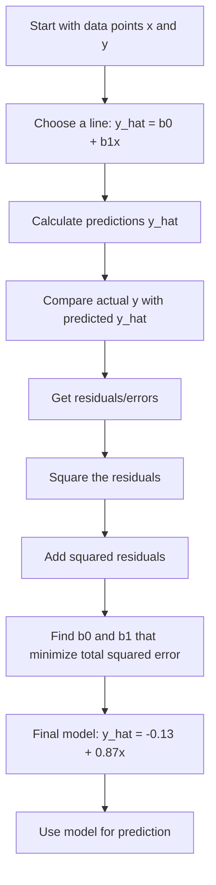

# Simple Linear Regression — Visual Notes with Clear Explanation

These notes explain the handwritten Simple Linear Regression pages in an easy way.  
The recreated visuals are included below, followed by a clear explanation of what is happening.

---

## Big Picture

Simple Linear Regression means:

> Use **one input** `x` to predict **one output** `y`.

The prediction formula is:

```math
\hat{y} = b_0 + b_1x
```

Read it like this:

```text
Predicted y = starting value + slope × x
```

In business terms:

```text
Predicted revenue = base revenue + effect of ad spend × ad spend
```

Examples:

| x = input | y = output |
|---|---|
| Ad spend | Revenue |
| Website sessions | Conversions |
| Clicks | Leads |
| Stock level | Sales |
| Discount % | Quantity sold |

---

# Visual 1 — Symbols and Meaning


## What is going on here?

This page explains the **basic vocabulary** of Simple Linear Regression.

### `R²`

```text
R² = how much variation/spread is explained by the model
```

Think of `R²` as the model’s explanation score.

| R² value | Meaning |
|---:|---|
| 0 | Model explains nothing |
| 0.50 | Model explains about half of the variation |
| 0.90 | Model explains most of the variation |
| 1 | Perfect explanation |

Example:

```text
If R² = 0.80, then around 80% of the movement in y is explained by x in this linear model.
```

In marketing:

```text
If x = ad spend and y = revenue,
R² tells how much of revenue movement is explained by ad spend.
```

Important:

```text
High R² does not prove causation.
```

It only says the line fits the data well.

---

## `coef` = coefficient = `b₁`

The note says:

```text
coef → Steigung der Geraden → b₁
```

Meaning:

```text
b₁ = slope of the line
```

The slope tells how much the prediction changes when `x` increases by 1.

Example:

```math
\hat{y} = 10 + 0.03x
```

Here:

```text
b₁ = 0.03
```

So:

```text
Every +1 in x increases predicted y by 0.03.
Every +1000 in x increases predicted y by 30.
```

If `x = sessions` and `y = conversions`:

```text
1000 extra sessions → about 30 extra conversions
```

---

## `intercept` = `b₀`

The note says:

```text
intercept → y-Achsenabschnitt → b₀
```

Meaning:

```text
b₀ = where the line cuts the y-axis
```

It is the predicted value when `x = 0`.

Example:

```math
\hat{y} = 5000 + 2.5x
```

Here:

```text
b₀ = 5000
```

Business meaning:

```text
When x = 0, predicted y = 5000.
```

If `x = ad spend` and `y = revenue`, then `b₀` is the baseline revenue when ad spend is zero.

---

## Means: `x̄` and `ȳ`

The page shows:

```text
x̄ = mean(x)
ȳ = mean(y)
```

Meaning:

```text
x̄ = average of all x-values
ȳ = average of all y-values
```

Example:

| Campaign | Clicks x | Leads y |
|---|---:|---:|
| A | 100 | 5 |
| B | 200 | 10 |
| C | 300 | 15 |

```text
x̄ = average clicks = 200
ȳ = average leads = 10
```

The mean is the center of the values.

---

## `ŷ` = prediction

The page shows:

```text
ŷ = prediction = y_pred
```

This is the model’s guessed value.

Actual value:

```text
y = true output
```

Predicted value:

```text
ŷ = model output
```

Example:

```text
Actual leads = 20
Predicted leads = 18
```

Then:

```text
y = 20
ŷ = 18
```

---

## `m`, `n`, `X`, and `y`

The page shows:

```text
m = Anzahl an Samples
n = Anzahl an Features
X ∈ R^(m×n)
y ∈ R^n
```

Simple meaning:

| Symbol | Easy meaning |
|---|---|
| `m` | number of rows / observations / samples |
| `n` | number of input columns / features |
| `X` | table of input data |
| `y` | output/target column |

Example:

| Campaign | Clicks | Spend | Leads |
|---|---:|---:|---:|
| A | 100 | 50 | 5 |
| B | 200 | 80 | 9 |
| C | 300 | 120 | 14 |

Here:

```text
m = 3 rows
n = 2 features: clicks and spend
X = input table
y = leads column
```

For **simple** linear regression, usually we have only one feature:

```text
n = 1
```

---

# Visual 2 — Regression Line, Errors, and Data


## What is going on here?

This page shows the main idea visually.

You have data points:

| x | y |
|---:|---:|
| 1 | 0.5 |
| 2 | 3 |
| 3 | 1 |
| 4 | 4 |
| 5 | 3 |
| 6 | 6 |

These are shown as points on the graph.

The model draws a line:

```math
\hat{y} = b_0 + b_1x
```

This line is called:

```text
Regressionsgerade = regression line
```

It is the prediction line.

---

## What are the vertical blue lines?

The vertical lines show the prediction mistakes.

For each x-value:

```text
actual y is the real point
predicted ŷ is the point on the regression line
```

The difference is the error/residual.

```math
\epsilon_i = y_i - \hat{y}_i
```

or sometimes:

```math
\epsilon_i = \hat{y}_i - y_i
```

The sign convention can change, but the idea is the same:

```text
Residual = actual value minus predicted value
```

## Simple visual

```text
actual point ●
             |
             | residual / error
             |
line --------● predicted point
```

A short vertical line means:

```text
small prediction error
```

A long vertical line means:

```text
large prediction error
```

---

## What does the table mean?

The table on the page has three columns:

| Column | Meaning |
|---|---|
| `X` | input value |
| `Y` | actual output |
| `Ŷ` | predicted output |

The prediction column is calculated using:

```math
\hat{y}=b_0+b_1x
```

For example:

```text
If x = 4:
ŷ = b₀ + b₁ × 4
```

That is why the table shows:

```text
b₀ + b₁·1
b₀ + b₁·2
b₀ + b₁·3
...
```

---

## What is the main question?

The page asks:

```text
What influence do b₀ and b₁ have on prediction accuracy?
```

Answer:

```text
b₀ and b₁ define the line.
The line defines the predictions.
The predictions define the errors.
So b₀ and b₁ directly control model accuracy.
```

If `b₀` and `b₁` are bad, the line is bad.

If the line is bad, predictions are bad.

If predictions are bad, residuals are large.

---

## Business example

Suppose:

```text
x = ad spend
y = revenue
```

Regression draws a line showing the general relationship:

```text
more ad spend → more predicted revenue
```

But not every campaign will be exactly on the line.

Why?

Because revenue is also affected by:

- campaign quality
- landing page
- seasonality
- competition
- brand strength
- discounts
- stock availability
- tracking issues

So the regression line gives the **general trend**, not perfect truth.

---

# Visual 3 — Least Squares and Residual Vectors


## What is going on here?

This page converts the regression idea into mathematical form.

It says:

```text
We have actual y-values.
We have predicted ŷ-values.
The difference between them is error ε.
```

---

## Vectors

The notes show:

```math
X =
\begin{pmatrix}
x_1\\
\vdots\\
x_6
\end{pmatrix}
```

```math
Y =
\begin{pmatrix}
y_1\\
\vdots\\
y_6
\end{pmatrix}
```

```math
\hat{Y} =
\begin{pmatrix}
\hat{y}_1\\
\vdots\\
\hat{y}_6
\end{pmatrix}
```

Simple meaning:

```text
A vector is just a column of numbers.
```

So:

```text
X = all input values
Y = all actual output values
Ŷ = all predicted output values
```

---

## Error vector

The note shows:

```math
\epsilon =
\begin{pmatrix}
\epsilon_1\\
\vdots\\
\epsilon_6
\end{pmatrix}
=
\begin{pmatrix}
y_1-\hat{y}_1\\
\vdots\\
y_6-\hat{y}_6
\end{pmatrix}
```

Simple meaning:

```text
Error vector = list of all prediction mistakes
```

Example:

| i | Actual y | Predicted ŷ | Error |
|---:|---:|---:|---:|
| 1 | 0.5 | 0.74 | -0.24 |
| 2 | 3.0 | 1.61 | 1.39 |
| 3 | 1.0 | 2.48 | -1.48 |

The error vector contains:

```text
-0.24, 1.39, -1.48, ...
```

---

## Sum of least squares

The note shows:

```math
\sum_{i=1}^{6}(y_i-\hat{y}_i)^2
```

This means:

```text
Take every prediction error.
Square it.
Add all squared errors.
```

This is called:

```text
Sum of Squared Errors
```

or:

```text
Least Squares objective
```

---

## Why square the errors?

Because positive and negative errors should not cancel.

Example:

```text
Error 1 = +5
Error 2 = -5
```

If we add directly:

```math
5 + (-5) = 0
```

This looks perfect, but it is not.

If we square:

```math
5^2 + (-5)^2 = 25 + 25 = 50
```

Now both mistakes are counted.

---

## What does `εᵀε` mean?

The note ends with:

```math
\epsilon^T\epsilon
```

This is a compact matrix/vector way to write:

```math
\epsilon_1^2+\epsilon_2^2+\cdots+\epsilon_6^2
```

In simple words:

```text
εᵀε = total squared error
```

---

## What is the goal?

The page says:

```text
Minimize the deviations/residuals.
```

That means:

```text
Find b₀ and b₁ that make the total squared error as small as possible.
```

This is the heart of linear regression.

---

# Visual 4 — Solving for the Model


## What is going on here?

This page shows how the notes calculate the best `b₀` and `b₁`.

The goal is still:

```text
Find the line with the smallest total squared error.
```

The line is:

```math
\hat{y}_i = b_0 + b_1x_i
```

---

## Step 1: Start with the squared error

The error function is:

```math
S(b_0,b_1)=\sum_{i=1}^{6}(y_i-b_0-b_1x_i)^2
```

This means:

```text
Total squared error depends on b₀ and b₁.
```

We want the best values of `b₀` and `b₁`.

---

## Step 2: Use derivatives to find the minimum

The page shows partial derivatives:

```math
\frac{\partial S}{\partial b_0}=0
```

```math
\frac{\partial S}{\partial b_1}=0
```

Simple meaning:

> We are finding the bottom of the error curve.

Imagine error like a bowl:

```text
Error
↑
|        \       /
|         \     /
|          \   /
|           \_/
+----------------→ possible line values
```

The best model is at the bottom of the bowl.

Derivatives help us find that bottom.

---

## Step 3: Insert the data values

The page says:

```text
Setze Werte für xi und yi in die Gleichungen ein
```

Meaning:

```text
Put the x and y values into the equations.
```

The data is:

| x | y |
|---:|---:|
| 1 | 0.5 |
| 2 | 3 |
| 3 | 1 |
| 4 | 4 |
| 5 | 3 |
| 6 | 6 |

The page also shows predicted values:

| x | y | ŷ |
|---:|---:|---:|
| 1 | 0.5 | 0.74 |
| 2 | 3 | 1.61 |
| 3 | 1 | 2.48 |
| 4 | 4 | 3.35 |
| 5 | 3 | 4.22 |
| 6 | 6 | 5.05 |

---

## Step 4: Get two equations

The notes simplify the derivative conditions into two equations:

```math
42b_0 + 182b_1 = 153
```

```math
12b_0 + 42b_1 = 35
```

Why two equations?

Because we have two unknowns:

```text
b₀ and b₁
```

So we need two equations to solve them.

---

## Step 5: Solve the equation system

The note says:

```text
Löse das LGS
```

Meaning:

```text
Solve the linear equation system.
```

Using Gaussian elimination, the notes get:

```math
b_0 = -0.13
```

```math
b_1 = 0.87
```

---

## Step 6: Final model

The final model is:

```math
\hat{y}_i = -0.13 + 0.87x_i
```

Meaning:

```text
Predicted y = -0.13 + 0.87 × x
```

## Interpretation

### `b₀ = -0.13`

The intercept is slightly below zero.

```text
When x = 0, predicted y is -0.13.
```

This may not have a useful real-life meaning, but mathematically it positions the line.

### `b₁ = 0.87`

The slope is positive.

```text
For every +1 increase in x,
predicted y increases by about 0.87.
```

Business example:

```text
If x = ad spend level
and y = revenue level,

then every +1 unit of ad spend increases predicted revenue by about 0.87 units.
```

---

# Final Prediction Table

Using:

```math
\hat{y} = -0.13 + 0.87x
```

| x | Actual y | Predicted ŷ | Error y - ŷ |
|---:|---:|---:|---:|
| 1 | 0.5 | 0.74 | -0.24 |
| 2 | 3.0 | 1.61 | 1.39 |
| 3 | 1.0 | 2.48 | -1.48 |
| 4 | 4.0 | 3.35 | 0.65 |
| 5 | 3.0 | 4.22 | -1.22 |
| 6 | 6.0 | 5.09 | 0.91 |

Note: the visual shows `5.05` for the last prediction, while the rounded formula gives about `5.09`. This is a small rounding/handwritten-note difference. The important idea is the same.

---

# The Complete Story in One Flow



---

# What You Should Remember

## 1. Regression line

```math
\hat{y}=b_0+b_1x
```

This is the prediction line.

## 2. Intercept

```text
b₀ = where the line starts
```

## 3. Slope

```text
b₁ = how much prediction changes when x increases by 1
```

## 4. Residual

```text
residual = actual - predicted
```

## 5. Least squares

```text
choose the line with the smallest total squared residuals
```

## 6. Final model from these notes

```math
\hat{y}=-0.13+0.87x
```

---

# Business Memory Hook

Think of this as a campaign prediction model:

```text
x = campaign spend
y = campaign revenue
```

The model learns:

```text
Revenue ≈ -0.13 + 0.87 × Spend
```

It does not predict perfectly, but it captures the general upward trend.

So the model says:

```text
As x increases, y tends to increase.
```

That is the main point of Simple Linear Regression.

---

# Ultra-Simple Summary

```text
1. We have dots.
2. We draw a line through them.
3. The line makes predictions.
4. Predictions have mistakes.
5. We square and add the mistakes.
6. We move the line until the total mistake is smallest.
7. That final line is the regression model.
```
