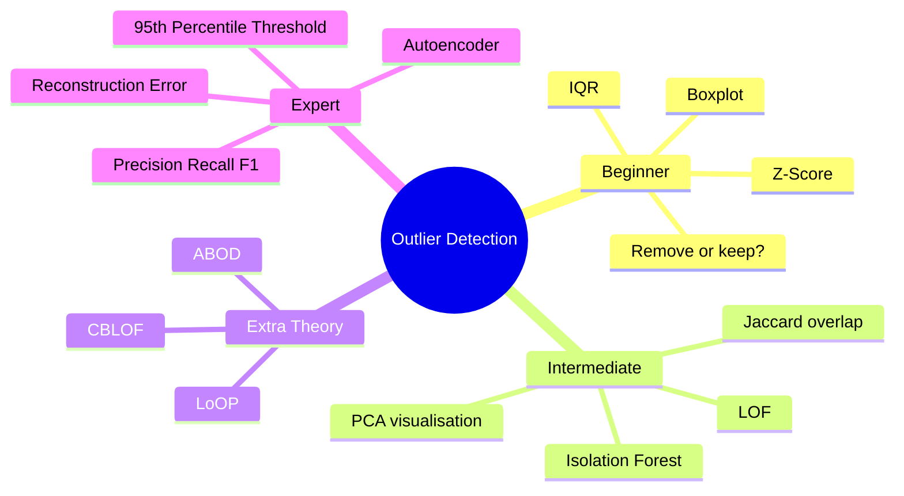
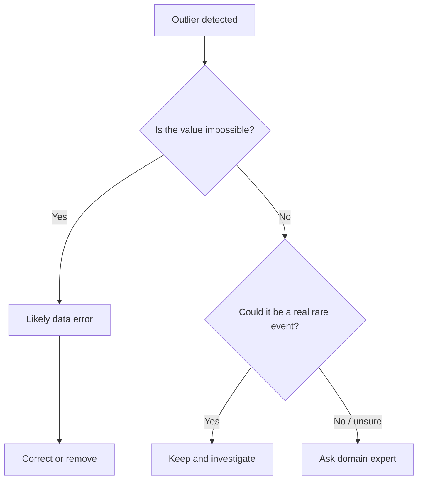
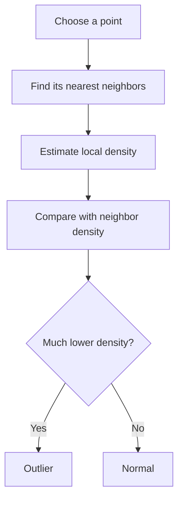
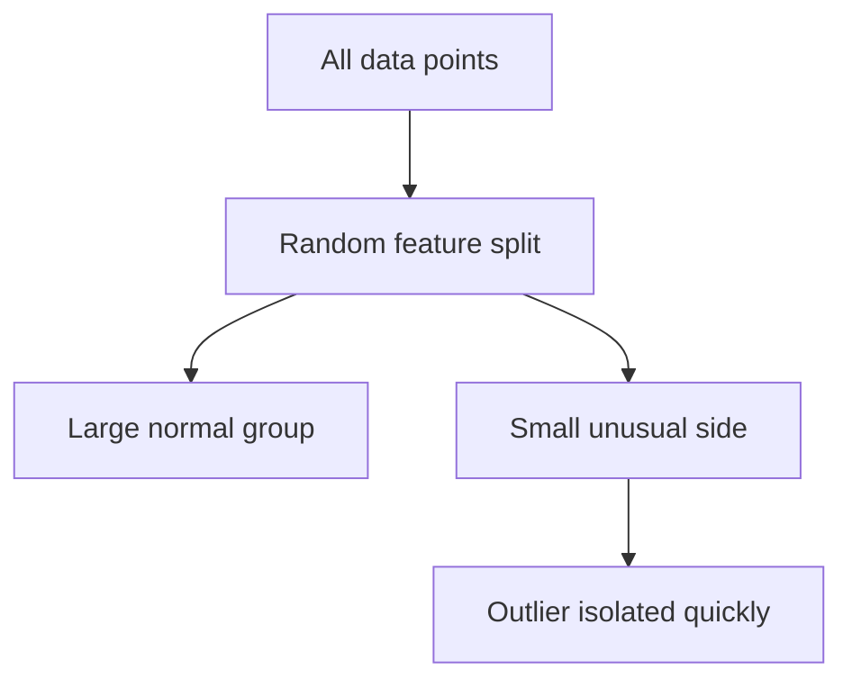
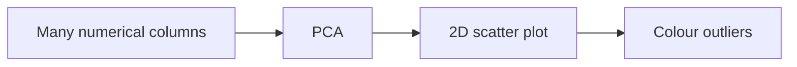
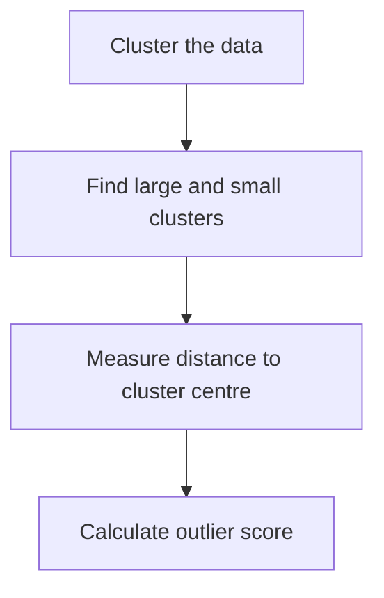
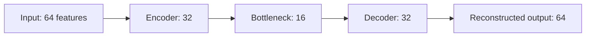

# Learning Day 4 — Outlier Detection  
## Visual, Simplified, Zero-to-Hero Theory Notes

> Goal: understand **all theory first**, visually and simply, before writing code.

---

# 0. The full map

Outlier detection answers one question:

> **Which data points do not behave like the majority?**



---

# 1. What is an outlier?

An **outlier** is a point that is very different from the normal data pattern.

## Visual idea

```text
Normal points are together:

        . . . . .
      . . . . . . .
      . . . . . . .
        . . . . .

Outlier is separated:

        . . . . .
      . . . . . . .
      . . . . . . .
        . . . . .                 *
```

The `*` point is unusual.

## Business examples

| Area | Normal pattern | Outlier |
|---|---|---|
| Machine sensors | temperature 70–80°C | temperature 170°C |
| Fraud | customer spends €20–€80 | one transaction €5,000 |
| Marketing | CTR around 2–4% | campaign CTR 35% |
| Inventory | daily demand 10–30 units | one day 800 units |
| Network security | normal traffic | strange attack-like traffic |

## Important idea

An outlier is not automatically bad.

It can be:
- a **mistake**,
- a **fraud attempt**,
- a **machine failure signal**,
- or a **rare but real business event**.

So we detect first, investigate second, and remove only when justified.

---

# 2. Outlier vs anomaly

People often use both words similarly.

But for practical understanding:

| Word | Meaning |
|---|---|
| Outlier | Looks unusual in the data |
| Anomaly | Unusual and important / suspicious |

## Example

A machine sensor value is `0`.

It could mean:
- sensor is broken → data error
- machine is off → real event
- missing value filled incorrectly → preprocessing issue

Same value, different meaning.

That is why **domain knowledge is required**.

---

# 3. Should we remove outliers?

## Simple rule

> Never remove outliers only because they look strange.

## Decision tree



## Keep vs remove

| Situation | Action |
|---|---|
| Sensor impossible value | remove/correct |
| Data entry typo | remove/correct |
| Fraud transaction | keep and label/investigate |
| Rare customer behavior | keep |
| Machine failure signal | keep |
| Unknown reason | investigate first |

---

# 4. Why outliers are dangerous for statistics

Outliers can heavily distort the **mean** and **standard deviation**.

## Example

Without outlier:

```text
10, 11, 12, 11, 10
Mean = 10.8
```

With one outlier:

```text
10, 11, 12, 11, 50
Mean = 18.8
```

One value changed the average a lot.

## Visual meaning

```text
Before:
10  10  11  11  12

After:
10  10  11  11  50
                  ↑
            pulls mean to the right
```

---

# 5. Beginner method 1 — Z-Score

## Meaning

A **Z-Score** tells us:

> How far is this value from the mean, measured in standard deviations?

## Formula

\[
z = \frac{x - \mu}{\sigma}
\]

Where:
- `x` = current value
- `μ` = mean
- `σ` = standard deviation

## Visual idea

```text
                 mean
                  |
Normal zone:   ---|---
Far point:              *
```

The farther the point is from the mean, the larger the Z-Score.

## Example

Machine temperature:

| Value | Mean | Std | Z-Score | Meaning |
|---:|---:|---:|---:|---|
| 75 | 75 | 5 | 0 | exactly normal |
| 80 | 75 | 5 | 1 | slightly high |
| 90 | 75 | 5 | 3 | very high |
| 100 | 75 | 5 | 5 | strong outlier |

## Rule

Usually:

```text
absolute Z-Score > 3  →  outlier
```

Use absolute value because both directions matter:

```text
Very low value  → outlier
Very high value → outlier
```

## Visual scale

```text
-3        -2        -1        0        1        2        3
 |---------|---------|--------|--------|--------|--------|
outlier          normal range around mean              outlier
```

## Strengths

- very simple
- easy to explain
- fast
- good first check

## Weaknesses

- assumes data is roughly normal / bell-shaped
- mean and std are affected by outliers
- checks columns separately
- can miss combination-based anomalies

---

# 6. Beginner method 2 — IQR and Boxplot

## What is IQR?

IQR means **Interquartile Range**.

\[
IQR = Q3 - Q1
\]

Where:
- `Q1` = 25th percentile
- `Q3` = 75th percentile

It measures the spread of the middle 50% of data.

## Boxplot visual

```text
lower whisker       Q1      median      Q3       upper whisker
     |--------------[========|==========]--------------|
  possible outlier *                                  * possible outlier
```

## Boxplot outlier rule

```text
Lower bound = Q1 - 1.5 × IQR
Upper bound = Q3 + 1.5 × IQR
```

Values outside those bounds are potential outliers.

## Why IQR is useful

IQR is more robust than mean/std because it focuses on the middle part of the data.

## Z-Score vs IQR

| Method | Uses | Good when | Weakness |
|---|---|---|---|
| Z-Score | mean and std | data is roughly normal | sensitive to outliers |
| IQR / Boxplot | quartiles | skewed data or robust view | only simple univariate view |

---

# 7. Why advanced methods are needed

Z-Score and boxplots usually look at **one column at a time**.

But real anomalies can be hidden in combinations.

## Example

| Temperature | Pressure | Vibration | Looks abnormal? |
|---:|---:|---:|---|
| normal | normal | normal | no |
| slightly high | slightly high | slightly high | maybe yes together |

Each column alone may look okay, but together the pattern may be strange.

That is why we need:
- LOF
- Isolation Forest
- ABOD
- Autoencoders

---

# 8. LOF — Local Outlier Factor

## Actual image


## Simple meaning

LOF asks:

> Is this point less dense than its neighbors?

## Visual idea

Imagine two points:

```text
Dense region:
. . . . .
. . X . .
. . . . .

Sparse / strange region:
.       .
    Y
.       .
```

- `X` has many close neighbors → normal
- `Y` has fewer / different local neighbors → suspicious

## What LOF compares

LOF compares:
- density around the point
- density around its neighbors

If the point is much less dense than its neighbors, it becomes an outlier.

## Simple process



## Strengths

- good for local anomalies
- useful when different clusters have different densities

## Weaknesses

- depends on number of neighbors
- score can be hard to explain
- struggles in very high dimensions

## One-line memory

> LOF = “My neighborhood is much emptier than my neighbors’ neighborhoods.”

---

# 9. Isolation Forest

## Actual image


## Simple meaning

Isolation Forest asks:

> How quickly can I separate this point from all other points?

## Core idea

Anomalies are often:
- rare
- different
- easier to separate

So they need fewer random splits.

## Visual idea

```text
Normal point inside group:

. . . . .
. . X . .
. . . . .

Hard to isolate X because many points surround it.

Outlier:

. . . . .
. . . . .                       *
                                ↑
                        easy to isolate
```

## Random split logic



## Important term: path length

Path length = number of splits needed to isolate a point.

| Point type | Splits needed | Meaning |
|---|---:|---|
| Normal | many | hard to isolate |
| Outlier | few | easy to isolate |

## What contamination means

`contamination = 0.05` means:

> We expect around 5% of the data to be outliers.

## Strengths

- fast
- scalable
- good baseline
- works well with many features
- does not directly rely on distance/density

## Weaknesses

- contamination must be chosen
- may miss subtle local anomalies
- randomness means results depend on settings

## One-line memory

> Isolation Forest = “Outliers are easier to cut away from the crowd.”

---

# 10. LOF vs Isolation Forest

| Question | LOF | Isolation Forest |
|---|---|---|
| What does it ask? | Is my local density low? | Can I be isolated quickly? |
| Main logic | neighborhood density | random cuts |
| Good for | local anomalies | general anomaly detection |
| Needs distance? | yes | not directly |
| Main parameter | neighbors | contamination |
| Visual intuition | lonely in local area | easy to separate |

## Simple comparison

```text
LOF:
Looks around the point.

Isolation Forest:
Cuts the space until the point separates.
```

---

# 11. PCA for visualising outliers

## Why PCA is used

If we have many sensor columns, we cannot draw them directly.

PCA compresses many columns into 2 visual axes:

```text
many sensor columns  →  PCA  →  PC1 and PC2
```

## Visual workflow



## Important

PCA is not the main outlier detector here.

It is mainly for **visual understanding**.

---

# 12. Jaccard coefficient

## Meaning

Jaccard measures how much two methods agree.

\[
J(A,B) = \frac{|A \cap B|}{|A \cup B|}
\]

## Visual idea

```text
Isolation Forest outliers:  {1, 2, 3, 4}
LOF outliers:               {3, 4, 5, 6}

Overlap:                    {3, 4}
Union:                      {1, 2, 3, 4, 5, 6}

Jaccard = 2 / 6 = 0.33
```

## Interpretation

| Jaccard | Meaning |
|---:|---|
| 0 | no agreement |
| 0.3 | weak/moderate agreement |
| 0.7 | strong agreement |
| 1 | perfect agreement |

## Why useful

If Jaccard is low, methods are detecting different kinds of outliers.

That is not automatically bad.

---

# 13. ABOD — Angle-Based Outlier Detection

## Actual image


## Simple meaning

ABOD uses **angles**, not only distances.

It asks:

> From this point, do other points appear in many directions or mostly one direction?

## Point inside cluster

```text
      ↖  ↑  ↗
        \|/
    ← -- P -- →
        /|\
      ↙  ↓  ↘
```

Many directions → angle variation is high → likely normal.

## Outlier point

```text
P -----> . . . . . .
 \-----> . . . . . .
  \----> . . . . . .
```

Most points are in similar directions → angle variation is low → likely outlier.

## Why ABOD is useful

In high dimensions, distances become less useful.

ABOD tries to reduce this problem by using angle variance.

## Strengths

- useful idea for high-dimensional data
- less dependent only on distance

## Weaknesses

- can be computationally heavy
- less common in simple beginner workflows

## One-line memory

> ABOD = “Outliers see the rest of the data mostly in one direction.”

---

# 14. LoOP — Local Outlier Probabilities

## Problem LoOP solves

Some outlier scores are hard to interpret.

Example:

```text
LOF score = 2.3
```

A business user may ask:

> Is 2.3 very bad or only slightly bad?

## Simple meaning

LoOP tries to convert local outlierness into a probability-like score:

```text
0   → likely normal
1   → likely outlier
```

## Visual scale

```text
0.0       0.25       0.50       0.75       1.0
 |---------|----------|----------|----------|
normal       maybe suspicious       very suspicious
```

## Strengths

- easier to interpret
- probability-like output
- useful for local anomalies

## Weaknesses

- still depends on local neighborhood
- still needs parameter choices

## One-line memory

> LoOP = “LOF-style idea, but with easier probability-like scores.”

---

# 15. CBLOF — Cluster-Based Local Outlier Factor

## Actual image


## Simple meaning

CBLOF uses clusters.

It asks:

> Is this point far from a large cluster, or inside a very small strange cluster?

## Visual idea

```text
Large cluster:
o o o o o o o
o o o o o o o

Small suspicious cluster:
        * *
```

Small strange groups can be suspicious.

## Simplified process



## Strengths

- good when data naturally forms clusters
- can detect small abnormal groups

## Weaknesses

- depends on clustering quality
- if clustering is bad, outlier detection is bad

## One-line memory

> CBLOF = “Small strange clusters or far-away points may be outliers.”

---

# 16. Autoencoder anomaly detection

## Simple meaning

An autoencoder is a neural network that learns to copy normal data.

It has:
- encoder
- bottleneck
- decoder

## Your expert architecture

```text
Input 64 → 32 → 16 → 32 → Output 64
```

## Visual diagram



## Main idea

Train only on normal data.

Then:
- normal data reconstructs well
- anomalous data reconstructs badly

## Visual example

Normal point:

```text
Input:        [7.1, 3.2, 9.0]
Reconstructed:[7.0, 3.1, 8.9]
Error: small
```

Anomaly:

```text
Input:        [15.9, 0.2, 40.0]
Reconstructed:[8.0, 3.0, 9.2]
Error: large
```

## Reconstruction error

\[
MSE = \frac{1}{n}\sum_{i=1}^{n}(x_i - \hat{x}_i)^2
\]

Large error → suspicious.

---

# 17. 95th percentile threshold

## Meaning

Use the reconstruction errors from normal/training data.

Choose the value where 95% of errors are below it.

```text
Most normal errors:
0.01, 0.02, 0.03, 0.04, 0.05

Very high error:
0.30 → anomaly
```

## Visual scale

```text
normal errors                         suspicious errors
|-----------------------------------|------------------>
                                   95th percentile threshold
```

If error is above threshold → classify as anomaly.

---

# 18. Precision, Recall, F1

These evaluate anomaly predictions when true labels are available.

## Confusion matrix idea

| | Predicted normal | Predicted anomaly |
|---|---|---|
| Actually normal | TN | FP |
| Actually anomaly | FN | TP |

## Precision

```text
Of all predicted anomalies, how many were truly anomalies?
```

\[
Precision = \frac{TP}{TP + FP}
\]

High precision = fewer false alarms.

## Recall

```text
Of all real anomalies, how many did we catch?
```

\[
Recall = \frac{TP}{TP + FN}
\]

High recall = fewer missed anomalies.

## F1

```text
Balanced score between precision and recall.
```

\[
F1 = 2 \times \frac{Precision \times Recall}{Precision + Recall}
\]

## Business memory

| Metric | Business meaning |
|---|---|
| Precision | Do not annoy people with false alerts |
| Recall | Do not miss real danger |
| F1 | Balance both |

---

# 19. Autoencoder vs Isolation Forest

| Topic | Autoencoder | Isolation Forest |
|---|---|---|
| Learns normal pattern? | yes | not directly |
| Uses neural network? | yes | no |
| Complexity | higher | lower |
| Speed | medium/heavy | fast |
| Good baseline? | not always first | yes |
| Captures nonlinear relations? | strong | limited |
| Easy to explain? | medium | easier |

## Real-time deployment

Use **Isolation Forest** when:
- you need a quick baseline
- deployment must be simple
- data is tabular
- speed matters

Use **Autoencoder** when:
- normal patterns are complex
- nonlinear relations matter
- you have enough data and compute
- your ML pipeline is mature

---

# 20. Final comparison of all methods

| Method | Simplest meaning | Best use |
|---|---|---|
| Z-Score | far from mean | simple numeric columns |
| IQR / Boxplot | outside robust range | skewed/sensor distributions |
| LOF | locally lonely | local anomalies |
| LoOP | local anomaly probability | interpretable local scoring |
| ABOD | unusual angle pattern | high-dimensional theory |
| Isolation Forest | easy to isolate | fast general anomaly detection |
| CBLOF | strange cluster behavior | cluster-shaped data |
| Autoencoder | hard to reconstruct | complex normal patterns |

---

# 21. Final visual memory sheet

```text
Z-Score:
Far from average

IQR:
Outside boxplot whiskers

LOF:
Less dense than neighbors

LoOP:
LOF-like, but probability-style

ABOD:
Angles look unusual

Isolation Forest:
Separated quickly by random cuts

CBLOF:
Small/far cluster behavior

Autoencoder:
Cannot reconstruct it well
```

---

# 22. One-page interview answer

Outlier detection identifies data points that behave very differently from the majority. Outliers can be errors, fraud, rare events, or important failure signals, so they should not be removed blindly. Simple statistical methods like Z-Score and IQR detect extreme values in individual columns. More advanced methods detect complex patterns: LOF compares local density, Isolation Forest isolates unusual points using random splits, ABOD uses angle variance for high-dimensional data, LoOP gives probability-like local outlier scores, CBLOF uses cluster structure, and autoencoders detect anomalies through high reconstruction error after learning normal data. Methods may disagree because each defines “unusual” differently, so visualisation with PCA and overlap measures like Jaccard help interpret their results.

---

# 23. Course connection

For Day 4:

## Beginner
- Z-Score
- boxplot
- remove outliers
- compare mean/std

## Intermediate
- Isolation Forest
- LOF
- PCA visualisation
- Jaccard overlap

## Expert
- Autoencoder
- reconstruction error
- 95th percentile threshold
- Precision / Recall / F1
- compare with Isolation Forest
