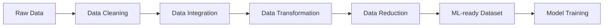
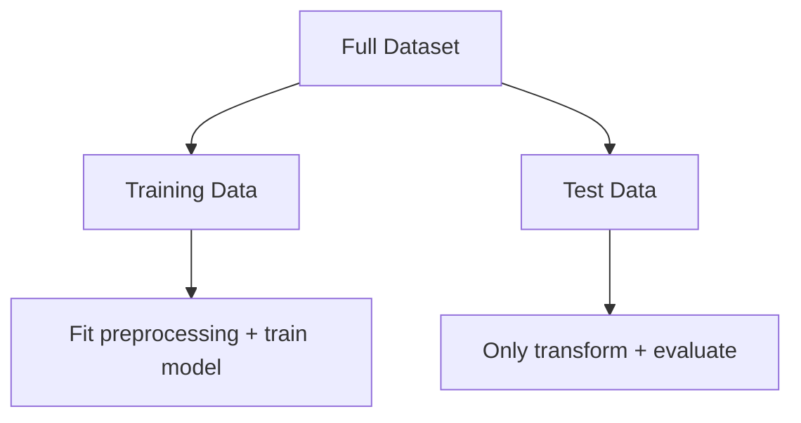
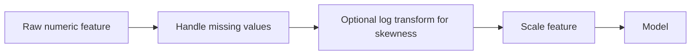
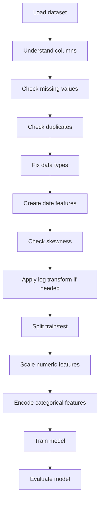

# Day 2 ML Notes: Data Preprocessing, Scaling, Skewness & Encoding  
### Simplified notes for Ruturaj — with professional BI / inventory / marketing examples

> **Goal of this note:**  
> Understand the Day 2 topic clearly before touching code.  
> Your tutor’s files use California Housing, Titanic, and small customer examples.  
> In your professional project, we will map the same ideas to **inventory, sales, demand, SKU, store, campaign, and customer data**.

---

## 1. Big picture: What is Data Preprocessing?

Raw business data is usually messy.

In real jobs, data comes from:
- SAP / ERP systems
- CRM tools
- Google Analytics / web analytics
- campaign platforms
- Excel exports
- inventory databases
- sales reports
- product master data

Machine learning models do **not** understand business mess directly.

They need clean, numeric, structured input.



### The 4 preprocessing steps from your German material

| German term | English meaning | Simple explanation | Professional example |
|---|---|---|---|
| **Datenbereinigung** | Data cleaning | Fix dirty data | Missing prices, duplicate SKUs, impossible negative demand |
| **Datenintegration** | Data integration | Combine data sources | Join SAP inventory + sales + product category |
| **Datenumwandlung** | Data transformation | Change data into useful format | Convert dates, scale numbers, encode categories |
| **Datenreduktion** | Data reduction | Keep useful data, reduce noise | Remove useless columns, aggregate daily sales to weekly |

---

## 2. Why preprocessing matters

A model is like a trainee analyst.

If you give it confusing data, it learns confusing patterns.

### Example

Imagine an inventory dataset:

| product_id | region | inventory_level | price | promotion | units_sold |
|---|---:|---:|---:|---|---:|
| P001 | South | 900 | 9.99 | Yes | 120 |
| P002 | North | 20 | 799.00 | No | 2 |
| P003 | West | missing | 25.00 | Yes | 40 |

Problems:
- `region` is text, but ML needs numbers.
- `promotion` is text, but ML needs numbers.
- `inventory_level` has a missing value.
- `price` and `inventory_level` are on very different scales.
- Some products may have extreme sales, causing outliers.
- Some columns may be skewed.

Preprocessing fixes these problems.

---

# PART A — Data Cleaning

## 3. Data cleaning

Data cleaning means making the dataset trustworthy.

### Common checks

| Check | Python idea | Business meaning |
|---|---|---|
| Missing values | `df.isna().sum()` | Is price, demand, stock, or category missing? |
| Duplicates | `df.duplicated().sum()` | Did the same transaction appear twice? |
| Wrong data types | `df.info()` | Is date stored as text instead of date? |
| Impossible values | filters | Negative inventory, negative price, impossible age |
| Outliers | boxplot / IQR | Extremely high demand or price |

### Example

```python
df.isna().sum()
df.duplicated().sum()
df.info()
df.describe()
```

---

## 4. Missing values

A missing value means the data is absent.

### What can we do?

| Situation | Common fix | Example |
|---|---|---|
| Few missing rows | Drop rows | Remove 5 bad rows from 100,000 rows |
| Numeric missing value | Median imputation | Fill missing price with median price |
| Categorical missing value | Mode imputation | Fill missing region with most common region |
| Missing has meaning | Create flag | `price_missing = 1` |

### Why median is often safer than mean

If sales values are:

```text
10, 12, 11, 13, 5000
```

The mean becomes very large because of `5000`.  
The median is more stable.

---

# PART B — Train/Test Split & Data Leakage

## 5. Train/test split

Machine learning must be tested on data it has not seen before.



### Simple explanation

| Data part | Purpose |
|---|---|
| **Training data** | Model learns from this |
| **Test data** | We check if the model works on unseen data |

Typical split:

```python
train_test_split(X, y, test_size=0.3, random_state=42)
```

This means:
- 70% training data
- 30% test data
- `random_state=42` makes the split reproducible

---

## 6. Data leakage — very important

Data leakage means the model accidentally sees information from the future or test data.

### Wrong way

```python
scaler.fit_transform(full_dataset)
train_test_split(...)
```

This is wrong because the scaler learned from the full dataset, including test data.

### Correct way

```python
X_train, X_test, y_train, y_test = train_test_split(X, y)

scaler.fit(X_train)
X_train_scaled = scaler.transform(X_train)
X_test_scaled = scaler.transform(X_test)
```

### Best professional way

Use a pipeline:

```python
Pipeline([
    ("preprocess", preprocessor),
    ("model", model)
])
```

This helps avoid leakage.

---

# PART C — Feature Scaling

## 7. What is feature scaling?

Feature scaling means changing numeric columns so their sizes become comparable.

### Example before scaling

| Feature | Range |
|---|---:|
| discount_percent | 0 to 50 |
| price | 1 to 2,000 |
| inventory_level | 0 to 50,000 |
| demand_forecast | 0 to 10,000 |

A model may wrongly think `inventory_level` is more important just because its numbers are bigger.

Scaling helps.

---

## 8. Which algorithms care about scaling?

| Algorithm type | Scaling important? | Why |
|---|---|---|
| Linear Regression | Often yes | Coefficients and regularization are scale-sensitive |
| Logistic Regression | Yes | Uses optimization / gradient descent |
| SVM | Yes | Uses distance / margin |
| KNN | Very yes | Based directly on distance |
| K-Means | Very yes | Based directly on distance |
| PCA | Very yes | Features with bigger variance can dominate |
| Neural Networks | Yes | Training becomes more stable |
| Random Forest | Usually less important | Tree splits are less sensitive to feature scale |
| Decision Trees | Usually less important | Tree-based logic uses thresholds |

### Simple rule

> If the model uses **distance**, **gradient descent**, or **regularization**, scaling usually matters.

---

# PART D — StandardScaler, MinMaxScaler, RobustScaler

## 9. StandardScaler

### What it does

StandardScaler changes data so that:
- mean becomes 0
- standard deviation becomes 1

Formula:

```text
scaled_value = (value - mean) / standard_deviation
```

### Example

If average product price is 100 and standard deviation is 20:

```text
price = 140

scaled_price = (140 - 100) / 20 = 2
```

So 140 is **2 standard deviations above average**.

### When to use

Use StandardScaler when:
- values are roughly normally distributed
- using Logistic Regression, Linear Regression, SVM, Neural Networks, PCA
- features have different units

### Weakness

StandardScaler is affected by outliers because mean and standard deviation are affected by extreme values.

Example:

```text
10, 11, 12, 13, 5000
```

The value `5000` pulls the mean upward.

### Important correction

StandardScaler does **not** magically make data normally distributed.

It only centers and scales the numbers.

---

## 10. MinMaxScaler

### What it does

MinMaxScaler puts values into a fixed range, usually 0 to 1.

Formula:

```text
scaled_value = (value - minimum) / (maximum - minimum)
```

### Example

If product price ranges from 10 to 110:

```text
price = 60

scaled_price = (60 - 10) / (110 - 10) = 0.5
```

So 60 is halfway between minimum and maximum.

### When to use

Use MinMaxScaler when:
- you want all values between 0 and 1
- algorithms need bounded input
- values do not have huge outliers
- you want easy interpretation

### Weakness

MinMaxScaler is very sensitive to outliers.

Example:

```text
10, 11, 12, 13, 5000
```

Because maximum is 5000, normal values get squeezed close to 0.

---

## 11. RobustScaler

### What it does

RobustScaler uses:
- median
- interquartile range, also called IQR

Formula:

```text
scaled_value = (value - median) / IQR
```

Where:

```text
IQR = Q3 - Q1
```

| Term | Meaning |
|---|---|
| Q1 | 25th percentile |
| Median / Q2 | 50th percentile |
| Q3 | 75th percentile |
| IQR | Middle 50% range |

### Why it is robust

Outliers affect the mean strongly.  
Outliers affect the median much less.

So RobustScaler is useful when you have:
- extreme sales days
- unusual demand spikes
- rare stockouts
- very large customers
- abnormal campaign results

### Important correction

RobustScaler does **not remove skewness**.

It reduces the influence of outliers during scaling.  
Skewness correction is usually done using transformations such as:
- log transformation
- Box-Cox transformation
- Yeo-Johnson transformation

---

## 12. Scaler cheat sheet

| Scaler | Formula idea | Best for | Outlier handling | Output range |
|---|---|---|---|---|
| **StandardScaler** | `(x - mean) / std` | Linear models, SVM, PCA, neural networks | Sensitive to outliers | No fixed range |
| **MinMaxScaler** | `(x - min) / (max - min)` | Simple 0–1 scaling, bounded inputs | Very sensitive to outliers | Usually 0 to 1 |
| **RobustScaler** | `(x - median) / IQR` | Data with outliers | Good against outliers | No fixed range |

---

## 13. Visual intuition

### Before scaling

```text
discount:        0 ─────── 50
price:           1 ───────────────────────────── 2000
inventory:       0 ───────────────────────────────────────────────────── 50000
```

The model sees very different number sizes.

### After scaling

```text
discount:      -2 ───── 0 ───── 2
price:         -2 ───── 0 ───── 2
inventory:     -2 ───── 0 ───── 2
```

Now the model can compare features more fairly.

---

# PART E — Skewness

## 14. What is skewness?

Skewness means the data is not balanced.

### Normal-looking distribution

```text
        *
      * * *
    * * * * *
  * * * * * * *
```

### Positive skew / right skew

Most values are small, but a few values are very large.

```text
*******
***
**
*
*
*
        *
              *
```

Professional examples:
- most customers buy little, few customers buy a lot
- most products sell normally, few products sell extremely high
- most campaigns get normal clicks, one campaign gets huge clicks
- most SKUs have normal inventory, some have very high stock

---

## 15. Why reduce skewness?

Skewness can create problems because:
- some models assume data is closer to normal
- extreme values can dominate model learning
- relationships may become easier to model after transformation
- visual analysis becomes clearer
- linear models may perform better

### Your tutor’s code checks skewness like this

```python
skewness = df.skew().sort_values(ascending=False)
skewed_features = skewness[abs(skewness) > 1].index
```

This means:
- calculate skewness for every numeric column
- select columns where skewness is strong
- transform them

---

## 16. Log transformation

Log transformation reduces positive skewness.

```python
df[feature] = np.log1p(df[feature])
```

### Why `log1p`?

`np.log1p(x)` means:

```text
log(1 + x)
```

This is safer than `log(x)` because:

```text
log(0) is not allowed
log(1 + 0) = log(1) = 0
```

### Example

| Original sales | log1p value |
|---:|---:|
| 0 | 0.00 |
| 10 | 2.40 |
| 100 | 4.62 |
| 1000 | 6.91 |

Notice what happens:

```text
Original:  0 ─ 10 ───────── 100 ───────────────────────── 1000
Log:       0 ─ 2.4 ─ 4.6 ─ 6.9
```

The huge value is compressed.

---

## 17. Box-Cox and Yeo-Johnson

These are more advanced transformations.

| Transformation | Works with zero/negative values? | Main use |
|---|---|---|
| **Box-Cox** | No, strictly positive only | Reduce skewness |
| **Yeo-Johnson** | Yes | Reduce skewness when zeros/negatives exist |

For a beginner project, log transformation is usually enough to understand the concept.

---

# PART F — Scaling vs Transformation

## 18. Scaling and skewness transformation are not the same

| Action | Purpose | Example |
|---|---|---|
| Log transformation | Fix skewness / compress extremes | `np.log1p(units_sold)` |
| StandardScaler | Mean 0, standard deviation 1 | `(x - mean) / std` |
| MinMaxScaler | Put values between 0 and 1 | `(x - min) / range` |
| RobustScaler | Reduce outlier influence in scaling | `(x - median) / IQR` |

### Correct order in many cases



---

# PART G — Encoding Categorical Variables

## 19. Why encoding is needed

ML models need numbers.

But business data often has categories:

| Column | Example values |
|---|---|
| region | North, South, West |
| product_category | Electronics, FMCG, Spare Parts |
| promotion | Yes, No |
| weather | Sunny, Rainy |
| customer_segment | B2B, B2C, Enterprise |

Encoding converts text categories into numbers.

---

## 20. One-Hot Encoding

One-hot encoding creates one column per category.

### Before

| region |
|---|
| North |
| South |
| West |

### After

| region_North | region_South | region_West |
|---:|---:|---:|
| 1 | 0 | 0 |
| 0 | 1 | 0 |
| 0 | 0 | 1 |

### When to use

Use OneHotEncoding when:
- categories have no natural order
- number of categories is small or medium

Examples:
- region
- product category
- weather condition
- campaign channel

### Weakness

If there are thousands of categories, one-hot encoding creates too many columns.

This is called **high cardinality**.

---

## 21. Ordinal / Label Encoding

Ordinal encoding assigns numbers to categories.

Example:

| size | encoded |
|---|---:|
| Small | 1 |
| Medium | 2 |
| Large | 3 |

Use it when there is a real order.

Do **not** use it blindly for unordered categories.

Bad example:

| region | encoded |
|---|---:|
| North | 1 |
| South | 2 |
| West | 3 |

This may wrongly suggest:

```text
West > South > North
```

But region has no mathematical order.

---

## 22. High-cardinality encoding

High cardinality means a categorical column has many unique values.

Examples:
- product_id
- customer_id
- store_id
- SKU
- city
- user_id

Your tutor’s file includes:
- Hashing Encoding
- Frequency Encoding
- Mean Target Encoding

---

## 23. Frequency Encoding

Replace a category with how often it appears.

### Example

| city | frequency |
|---|---:|
| New York | 2 |
| Los Angeles | 2 |
| San Diego | 1 |

Python idea:

```python
df["city_freq"] = df["city"].map(df["city"].value_counts())
```

### Professional example

For `product_id`:
- fast-moving SKUs appear often
- slow-moving SKUs appear less often

This can give the model useful information.

---

## 24. Mean Target Encoding

Replace a category with the average target value for that category.

Example target: `units_sold`

| product_id | average units_sold |
|---|---:|
| SKU_001 | 120 |
| SKU_002 | 15 |
| SKU_003 | 300 |

Python idea:

```python
product_means = df.groupby("product_id")["units_sold"].mean()
df["product_mean_units_sold"] = df["product_id"].map(product_means)
```

### Warning: leakage risk

Mean target encoding can easily leak target information.

Correct professional approach:
- calculate encoding only on training data
- apply to test data
- ideally use cross-validation target encoding

---

## 25. Hashing Encoding

Hashing converts categories into a fixed number of numeric columns.

Your tutor used:

```python
HashingVectorizer(n_features=5, norm=None, binary=True)
```

### Why use hashing?

Useful when:
- too many categories
- new categories appear in future data
- you want fixed output size

### Weakness

Different categories can map to the same hash bucket.  
This is called a collision.

---

# PART H — Polynomial Features

## 26. What are polynomial features?

Polynomial features create new columns by multiplying existing columns.

Example original features:

```text
price
discount
```

Polynomial features may create:

```text
price
discount
price²
discount²
price × discount
```

### Why useful?

Sometimes relationships are not straight lines.

Example:

```text
A 5% discount may increase sales a little.
A 50% discount may increase sales a lot.
```

A polynomial feature can help a linear model capture curved relationships.

---

## 27. Why scaling matters with polynomial features

Polynomial values can become huge.

Example:

```text
price = 1000
price² = 1,000,000
price³ = 1,000,000,000
```

This can dominate the model.

That is why your tutor’s exercise compares:
1. scaling before polynomial creation
2. polynomial creation before scaling

### Simple takeaway

For polynomial regression:
- scaling is very important
- Ridge or Lasso helps control overly large coefficients
- do not use very high polynomial degree unless necessary

---

# PART I — Models in your tutor’s file

## 28. Logistic Regression vs Random Forest

Your tutor compares:
- Logistic Regression
- Random Forest

### Logistic Regression

Despite the name, it is used for classification.

Examples:
- customer buys / does not buy
- stockout risk yes / no
- campaign conversion yes / no

Needs scaling more often because it is a linear model.

### Random Forest

A tree-based model.

Examples:
- predict stockout risk
- classify customer churn
- predict sales class

Less sensitive to scaling because it splits data by thresholds.

---

## 29. Ridge Regression

Ridge Regression is Linear Regression with regularization.

It tries to:
- predict a numeric value
- keep model coefficients controlled
- reduce overfitting

Professional examples:
- predict units sold
- predict demand
- predict revenue
- predict inventory requirement

---

## 30. RMSE

Your tutor’s file calculates RMSE.

```python
np.sqrt(mean_squared_error(y_test, y_pred))
```

RMSE means:

```text
Root Mean Squared Error
```

It tells how far predictions are from actual values on average, with stronger punishment for large mistakes.

For example, if predicting `units_sold`, RMSE is also in units sold.

---

# PART J — Mapping your tutor’s examples to your professional project

## 31. Tutor file vs your project

| Tutor exercise | Tutor dataset | Concept | Your professional version |
|---|---|---|---|
| Exercise 1 | California Housing | skewness + log + RobustScaler | inventory / demand / sales skewness |
| Exercise 3 | Titanic | StandardScaler + OneHotEncoder + Logistic Regression + Random Forest | stockout risk classification |
| Exercise 4 | California Housing | MinMaxScaler + PolynomialFeatures + Ridge | demand / units sold regression |
| Exercise 5 | small user/city data | high-cardinality encoding | product_id / store_id / customer_id encoding |

---

## 32. Recommended professional project

### Project title

**Inventory Demand & Stockout Risk Preprocessing Project**

### Possible business questions

1. Can we predict daily units sold for each product-store combination?
2. Can we identify stockout risk before it happens?
3. Which features need scaling?
4. Which columns are skewed?
5. Which categorical variables need encoding?
6. Which preprocessing choices help linear models vs tree models?

### Target variables

| ML problem | Target |
|---|---|
| Regression | `units_sold` |
| Classification | `stockout_risk` |

### Example stockout-risk logic

```python
df["stockout_risk"] = (df["inventory_level"] < df["demand_forecast"]).astype(int)
```

Meaning:

```text
1 = risk of stockout
0 = enough stock
```

---

# PART K — Practical preprocessing workflow

## 33. Full beginner workflow



---

## 34. Important order

Correct order:

```text
1. Load data
2. Clean data
3. Define X and y
4. Split train/test
5. Fit preprocessing only on training data
6. Transform train and test data
7. Train model
8. Evaluate on test data
```

---

## 35. Common beginner mistakes

| Mistake | Why it is bad |
|---|---|
| Scaling before train/test split | Causes data leakage |
| Encoding target information using full data | Causes leakage |
| Using LabelEncoder for unordered categories | Creates fake order |
| Ignoring outliers | Can distort scaler and model |
| Thinking StandardScaler creates normal distribution | It does not |
| Using MinMaxScaler with strong outliers | Normal values get squeezed |
| Dropping too many rows with missing values | Can lose useful data |
| Comparing models without same split | Unfair comparison |

---

# PART L — German-English glossary

| German | English | Simple meaning |
|---|---|---|
| Datenvorverarbeitung | Data preprocessing | Prepare data before ML |
| Datenbereinigung | Data cleaning | Fix missing, wrong, duplicate data |
| Datenintegration | Data integration | Combine sources |
| Datenumwandlung | Data transformation | Change format / scale / encode |
| Datenreduktion | Data reduction | Reduce columns / complexity |
| Datennormierung | Data normalization | Put data on comparable scale |
| Skalierung | Scaling | Adjust numeric ranges |
| Schiefe / Skewness | Skewness | Uneven distribution |
| Ausreißer | Outlier | Extreme value |
| Kategorische Variable | Categorical variable | Text/group column |
| Kodierung | Encoding | Convert category to numbers |
| Trainingsdaten | Training data | Data used to learn |
| Testdaten | Test data | Data used to evaluate |
| Datenleck / Data Leakage | Data leakage | Test/future information enters training |

---

# PART M — Quick memory cards

## 36. Memory card: StandardScaler

```text
Use when:
- linear/logistic regression
- SVM
- PCA
- neural networks
- roughly normal numeric features

Formula:
(x - mean) / std

Weakness:
sensitive to outliers
```

---

## 37. Memory card: MinMaxScaler

```text
Use when:
- need values between 0 and 1
- no extreme outliers
- easy interpretation needed

Formula:
(x - min) / (max - min)

Weakness:
very sensitive to outliers
```

---

## 38. Memory card: RobustScaler

```text
Use when:
- outliers exist
- median is more reliable than mean
- sales/demand/inventory has extreme spikes

Formula:
(x - median) / IQR

Weakness:
does not remove skewness
```

---

## 39. Memory card: OneHotEncoding

```text
Use when:
- categories have no order
- number of categories is manageable

Example:
region = North/South/West
```

---

## 40. Memory card: Target Encoding

```text
Use when:
- category has many values
- category has strong relation to target

Warning:
must avoid data leakage
```

---

# PART N — What we will code later

When we start coding, we will follow this order:

1. Load the professional dataset
2. Read column names and business meaning
3. Basic cleaning
4. Missing values
5. Duplicate check
6. Date features
7. Skewness table
8. Before/after histograms
9. Before/after boxplots
10. StandardScaler, MinMaxScaler, RobustScaler comparison
11. OneHotEncoding for small categorical columns
12. Frequency / target encoding for high-cardinality columns
13. Train/test split
14. Regression model: predict `units_sold`
15. Classification model: predict `stockout_risk`
16. Professional charts for portfolio/dashboard storytelling

---

# PART O — Mini summary

## 41. One-paragraph summary

Data preprocessing is the process of cleaning, transforming, scaling, encoding, and preparing raw data before machine learning. Scaling makes numeric features comparable. StandardScaler uses mean and standard deviation, MinMaxScaler uses minimum and maximum, and RobustScaler uses median and IQR. Skewness is different from scaling: skewness is about the shape of a distribution and is usually handled using log, Box-Cox, or Yeo-Johnson transformations. Categorical variables must be encoded into numbers using methods such as one-hot encoding, ordinal encoding, frequency encoding, target encoding, or hashing. The most important professional rule is to avoid data leakage by fitting preprocessing only on training data and then applying it to test or production data.

---

# Sources used

These notes combine:
- Your uploaded German Day 2 preprocessing material.
- Your uploaded Milos preprocessing exercise and solution files.
- The GeeksforGeeks article: **StandardScaler, MinMaxScaler and RobustScaler techniques - ML**.
- Scikit-learn documentation for preprocessing, StandardScaler, MinMaxScaler, and RobustScaler.
