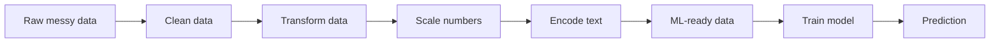
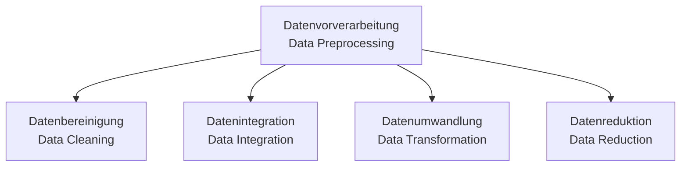
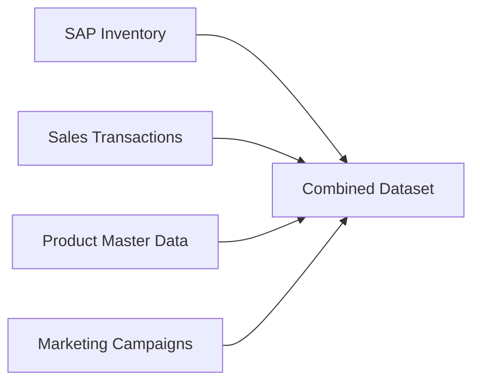
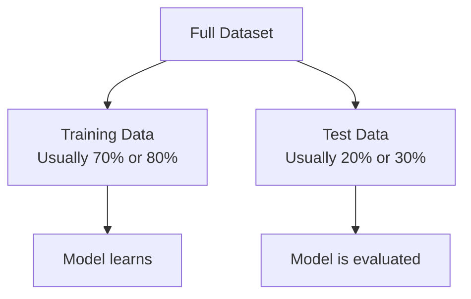
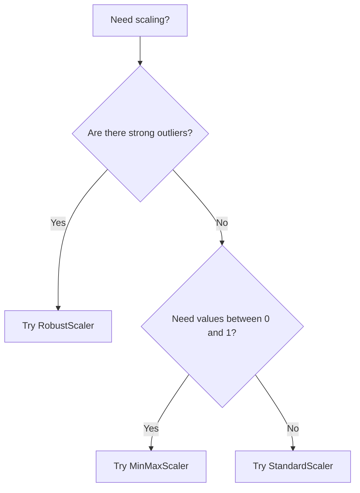
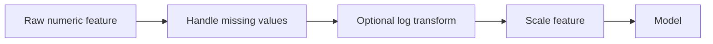
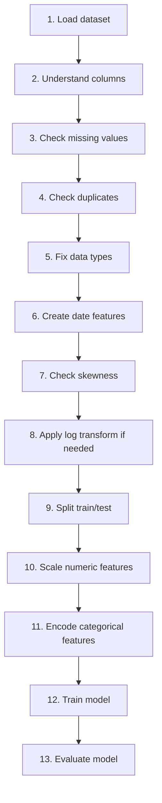

# Day 2 ML Notes — Data Preprocessing Explained Like You Are New to ML  
## Super simple version with visuals, examples, and professional BI / Inventory / Marketing use cases

> **Main idea:**  
> Machine Learning is not magic.  
> A model can only learn well if the data is clean, understandable, and prepared properly.

Think of ML like cooking.

```text
Raw ingredients  →  Wash / cut / prepare  →  Cook  →  Final dish
Raw data         →  Preprocessing          →  Model →  Prediction
```

If the ingredients are dirty or badly cut, the dish will be bad.  
If the data is dirty or badly prepared, the model will be bad.

---

# Table of Contents

1. What is data preprocessing?
2. Why do we need preprocessing?
3. The 4 big steps from your German notes
4. Data cleaning
5. Missing values
6. Train/test split
7. Data leakage
8. Feature scaling
9. StandardScaler
10. MinMaxScaler
11. RobustScaler
12. StandardScaler vs MinMaxScaler vs RobustScaler
13. Skewness
14. Log transformation
15. Box-Cox and Yeo-Johnson
16. Scaling vs transformation
17. Encoding categorical variables
18. One-Hot Encoding
19. Ordinal / Label Encoding
20. High-cardinality encoding
21. Frequency Encoding
22. Mean Target Encoding
23. Hashing Encoding
24. Polynomial Features
25. Logistic Regression, Random Forest, Ridge Regression
26. RMSE
27. Professional project mapping
28. Full beginner workflow
29. Common mistakes
30. German-English glossary
31. Memory cards
32. What we will code later

---

# 1. What is Data Preprocessing?

## Simple meaning

**Data preprocessing** means:

> Preparing raw data before giving it to a Machine Learning model.

Raw data is usually messy.  
ML models are very strict. They need data in a clean and numeric format.

---

## Kid-level example

Imagine your teacher asks you to solve a math problem.

But the paper looks like this:

```text
Question: 5 + ? = apple
Some numbers are missing.
Some words are mixed with numbers.
Some lines are duplicated.
Some values are impossible.
```

You cannot solve it properly.

So first you clean the paper:

```text
Question: 5 + 3 = ?
```

Now you can solve it.

That cleaning process is like **data preprocessing**.

---

## Business example

Imagine you have inventory data:

| product_id | region | inventory_level | price | promotion | units_sold |
|---|---:|---:|---:|---|---:|
| P001 | South | 900 | 9.99 | Yes | 120 |
| P002 | North | 20 | 799.00 | No | 2 |
| P003 | West | missing | 25.00 | Yes | 40 |

A human can understand this table.

But ML has problems:

| Problem | Why it is a problem |
|---|---|
| `region` is text | ML prefers numbers |
| `promotion` is Yes/No | ML needs numeric form |
| `inventory_level` has `missing` | ML cannot calculate with missing values |
| `price` and `inventory_level` have very different sizes | Some models get confused |
| Some products may have extreme sales | Outliers can distort learning |

So we preprocess.

---

## Big visual



---

# 2. Why do we need preprocessing?

## Main reason

A model learns from patterns.

If the data is messy, the model learns bad patterns.

```text
Bad data  →  Bad model  →  Bad prediction
Good data →  Better model → Better prediction
```

---

## Simple example

Imagine a model is trying to predict `units_sold`.

It sees this:

| price | discount | units_sold |
|---:|---:|---:|
| 10 | 5 | 100 |
| 20 | 10 | 200 |
| missing | 15 | 300 |
| 500000 | 5 | 1 |

Problems:

- Missing price
- One price is extremely high
- Price and discount are on different scales
- There may be outliers

Before ML, we must fix these issues.

---

# 3. The 4 big steps from your German notes

Your German material mentions these main preprocessing steps:



---

## 3.1 Datenbereinigung = Data Cleaning

Means: clean dirty data.

Examples:

| Dirty data problem | Simple fix |
|---|---|
| Missing price | Fill with median price |
| Duplicate order | Remove duplicate |
| Negative inventory | Investigate or fix |
| Wrong date format | Convert to date |
| Extreme sales value | Check outlier |

---

## 3.2 Datenintegration = Data Integration

Means: combine data from different sources.

Professional example:

```text
SAP inventory data
+ Sales data
+ Product category data
+ Campaign data
= One useful ML dataset
```

Visual:



---

## 3.3 Datenumwandlung = Data Transformation

Means: change data into a better format.

Examples:

| Original | Transformation |
|---|---|
| Date: `2025-01-15` | Month = January, Day = Wednesday |
| Region: `South` | Convert to numeric columns |
| Sales: very skewed | Apply log transformation |
| Price: 1 to 2000 | Scale price |

---

## 3.4 Datenreduktion = Data Reduction

Means: reduce unnecessary data.

Examples:

| Action | Why |
|---|---|
| Remove unused columns | Less noise |
| Aggregate daily data to weekly data | Easier trend analysis |
| Keep only useful features | Better model focus |
| Remove duplicate columns | Avoid confusion |

---

# 4. Data Cleaning

## Simple meaning

Data cleaning means:

> Fixing data before analysis or ML.

This is like cleaning your desk before studying.

If your desk is messy, you waste time.  
If your data is messy, the model learns badly.

---

## Common data cleaning checks

| Check | Python command | Simple question |
|---|---|---|
| Missing values | `df.isna().sum()` | Is something empty? |
| Duplicates | `df.duplicated().sum()` | Is the same row repeated? |
| Data types | `df.info()` | Are numbers really numbers? |
| Summary stats | `df.describe()` | Are values reasonable? |
| Unique values | `df["column"].unique()` | What categories exist? |

---

## Example

```python
df.isna().sum()
df.duplicated().sum()
df.info()
df.describe()
```

These commands are like asking:

```text
Is anything missing?
Is anything repeated?
Are the columns correct?
Do the numbers look strange?
```

---

# 5. Missing Values

## What is a missing value?

A missing value means some data is not available.

Example:

| product_id | price | units_sold |
|---|---:|---:|
| P001 | 10 | 100 |
| P002 | missing | 50 |
| P003 | 30 | 80 |

The price for P002 is missing.

---

## Why missing values are a problem

ML models cannot directly calculate with missing values.

For example:

```text
price + discount = ?
missing + 10 = impossible
```

So we must decide what to do.

---

## Common solutions

| Situation | Solution | Example |
|---|---|---|
| Very few missing rows | Drop rows | Remove 5 rows from 100,000 |
| Numeric column missing | Fill with median | Missing price → median price |
| Text/category missing | Fill with mode | Missing region → most common region |
| Missing itself is meaningful | Add flag column | `price_missing = 1` |

---

## Mean vs Median

Imagine these sales values:

```text
10, 12, 11, 13, 5000
```

### Mean

```text
Average = (10 + 12 + 11 + 13 + 5000) / 5
Average = 1009.2
```

This is too high because of 5000.

### Median

Sorted values:

```text
10, 11, 12, 13, 5000
```

Middle value:

```text
Median = 12
```

Median is more realistic.

### Easy rule

```text
If outliers exist → median is safer than mean
```

---

# 6. Train/Test Split

## Simple meaning

We divide data into two parts:

| Part | Purpose |
|---|---|
| Training data | Model learns from this |
| Test data | We check if model learned well |

---

## School exam example

Training data is like homework.  
Test data is like exam questions.

```text
Homework → Learn
Exam     → Test if you really understood
```

If you give the exam answers during homework, the student may score well but not truly learn.

Same with ML.

---

## Visual



---

## Python example

```python
from sklearn.model_selection import train_test_split

X_train, X_test, y_train, y_test = train_test_split(
    X,
    y,
    test_size=0.3,
    random_state=42
)
```

Meaning:

| Code | Meaning |
|---|---|
| `X` | Input features |
| `y` | Target column |
| `test_size=0.3` | 30% test data |
| `random_state=42` | Same random split every time |

---

# 7. Data Leakage

## Very important concept

Data leakage means:

> The model accidentally gets information it should not know.

This is one of the biggest beginner mistakes.

---

## School example

Imagine you are taking an exam.

If the teacher gives you the answer key before the exam, your score will be high.

But that does not mean you understood the topic.

This is like data leakage.

---

## ML example

Wrong:

```python
scaler.fit_transform(full_dataset)
train_test_split(...)
```

Why wrong?

Because the scaler learned information from both training and test data.

---

## Correct way

```python
X_train, X_test, y_train, y_test = train_test_split(X, y)

scaler.fit(X_train)
X_train_scaled = scaler.transform(X_train)
X_test_scaled = scaler.transform(X_test)
```

Meaning:

| Step | Explanation |
|---|---|
| `fit(X_train)` | Learn scaling values only from training data |
| `transform(X_train)` | Apply to training data |
| `transform(X_test)` | Apply same rule to test data |

---

## Best professional way

Use a pipeline:

```python
Pipeline([
    ("preprocess", preprocessor),
    ("model", model)
])
```

Pipeline helps keep the process safe and organized.

---

# 8. Feature Scaling

## Simple meaning

Feature scaling means:

> Changing numeric columns so they are on a comparable size.

---

## Why scaling is needed

Imagine two features:

| Feature | Values |
|---|---:|
| discount_percent | 0 to 50 |
| inventory_level | 0 to 50,000 |

The model may think inventory is more important just because the numbers are bigger.

But bigger number does not always mean more important.

---

## Kid-level example

Imagine comparing:

```text
Height in centimeters: 180
Weight in kilograms: 80
```

Height looks bigger because it is measured in centimeters.

But that does not automatically mean height is more important than weight.

Scaling helps compare fairly.

---

## Business example before scaling

| Feature | Range |
|---|---:|
| discount_percent | 0 to 50 |
| price | 1 to 2,000 |
| inventory_level | 0 to 50,000 |
| demand_forecast | 0 to 10,000 |

---

## Visual before scaling

```text
discount:      0 ─────── 50
price:         1 ───────────────────── 2,000
inventory:     0 ───────────────────────────────────────────── 50,000
demand:        0 ───────────────────────── 10,000
```

Different columns have very different sizes.

---

## Visual after scaling

```text
discount:      -2 ───── 0 ───── 2
price:         -2 ───── 0 ───── 2
inventory:     -2 ───── 0 ───── 2
demand:        -2 ───── 0 ───── 2
```

Now the model can compare features more fairly.

---

# 9. Which algorithms care about scaling?

Some models care a lot about feature scale.  
Some models care less.

---

## Scaling is important for these models

| Model | Why scaling matters |
|---|---|
| Linear Regression | Coefficients can be affected |
| Logistic Regression | Uses optimization |
| SVM | Uses distance/margins |
| KNN | Directly uses distance |
| K-Means | Directly uses distance |
| PCA | Big-variance features dominate |
| Neural Networks | Training becomes more stable |
| Ridge / Lasso | Regularization is scale-sensitive |

---

## Scaling is less important for these models

| Model | Why |
|---|---|
| Decision Tree | Uses split thresholds |
| Random Forest | Uses many decision trees |
| Gradient Boosted Trees | Tree-based logic |

But even for tree models, scaling can still be useful for clean pipelines and comparisons.

---

## Easy memory rule

```text
Distance model?        → Scale
Gradient descent?      → Scale
Regularized model?     → Scale
Tree model only?       → Scaling less important
```

---

# 10. StandardScaler

## Simple meaning

StandardScaler says:

> Let us measure each value compared to the average.

It changes data so that:

```text
average becomes 0
standard deviation becomes 1
```

---

## Formula

```text
scaled_value = (value - mean) / standard_deviation
```

Do not panic about the formula.

It simply asks:

```text
How far is this value from the average?
```

---

## Simple example

Product prices:

```text
60, 80, 100, 120, 140
```

Mean:

```text
100
```

Standard deviation:

```text
20 approximately
```

For price 140:

```text
scaled_price = (140 - 100) / 20 = 2
```

Meaning:

```text
140 is 2 standard deviations above average
```

---

## Visual idea

```text
Original prices:
60 ---- 80 ---- 100 ---- 120 ---- 140

After StandardScaler:
-2 ---- -1 ---- 0 ---- 1 ---- 2
```

---

## When to use StandardScaler

Use it for:

- Logistic Regression
- Linear Regression
- Ridge / Lasso
- SVM
- PCA
- Neural Networks
- features with different units

---

## Important correction

StandardScaler does **not** make the data normally distributed.

It only changes:

```text
center → 0
spread → 1
```

If the data is skewed before StandardScaler, it can still be skewed after StandardScaler.

---

## Weakness

StandardScaler is sensitive to outliers.

Example:

```text
10, 11, 12, 13, 5000
```

The extreme value `5000` pulls the mean upward.

So StandardScaler may behave badly when there are huge outliers.

---

# 11. MinMaxScaler

## Simple meaning

MinMaxScaler says:

> Let us squeeze all values between 0 and 1.

---

## Formula

```text
scaled_value = (value - minimum) / (maximum - minimum)
```

Again, simple meaning:

```text
Where is this value between the smallest and largest value?
```

---

## Simple example

Product prices:

```text
10, 35, 60, 85, 110
```

Minimum:

```text
10
```

Maximum:

```text
110
```

For price 60:

```text
scaled_price = (60 - 10) / (110 - 10)
scaled_price = 50 / 100
scaled_price = 0.5
```

Meaning:

```text
60 is halfway between min and max
```

---

## Visual

```text
Original:
10 ---- 35 ---- 60 ---- 85 ---- 110

After MinMaxScaler:
0 ---- 0.25 ---- 0.5 ---- 0.75 ---- 1
```

---

## When to use MinMaxScaler

Use it when:

- you want values between 0 and 1
- there are no big outliers
- the algorithm benefits from bounded inputs
- you want easy interpretation

---

## Weakness

MinMaxScaler is very sensitive to outliers.

Example:

```text
10, 11, 12, 13, 5000
```

Because max is 5000, normal values get squeezed near 0:

```text
10   → almost 0
11   → almost 0
12   → almost 0
13   → almost 0
5000 → 1
```

This can hide important differences among normal values.

---

# 12. RobustScaler

## Simple meaning

RobustScaler says:

> Let us scale using the middle of the data, not the extreme values.

It uses:

- median
- IQR

---

## What is median?

Median is the middle value.

Example:

```text
10, 11, 12, 13, 5000
```

Median:

```text
12
```

The outlier 5000 does not change the median much.

---

## What is IQR?

IQR means Interquartile Range.

```text
IQR = Q3 - Q1
```

| Term | Meaning |
|---|---|
| Q1 | 25th percentile |
| Q2 / Median | 50th percentile |
| Q3 | 75th percentile |
| IQR | Middle 50% of values |

---

## Formula

```text
scaled_value = (value - median) / IQR
```

Simple meaning:

```text
How far is this value from the middle part of the data?
```

---

## Visual

```text
Small values        Middle 50% values              Big values
|-------------------|============================|-------------------|
                    Q1          Median          Q3

RobustScaler focuses mostly on this middle section.
```

---

## When to use RobustScaler

Use it when:

- data has outliers
- sales has sudden spikes
- demand has extreme days
- some customers buy huge quantities
- some products have abnormal inventory

---

## Professional example

Inventory data:

```text
Normal daily sales: 10, 12, 15, 18, 20
Festival sale day: 1000
```

RobustScaler handles this better than StandardScaler or MinMaxScaler.

---

## Important correction

RobustScaler does **not remove skewness**.

It helps with outliers during scaling.

Skewness is handled by transformations like:

- log transformation
- Box-Cox
- Yeo-Johnson

---

# 13. StandardScaler vs MinMaxScaler vs RobustScaler

## Comparison table

| Scaler | Uses | Output | Good for | Bad when |
|---|---|---|---|---|
| StandardScaler | Mean and standard deviation | No fixed range | Linear models, SVM, PCA | Strong outliers |
| MinMaxScaler | Minimum and maximum | Usually 0 to 1 | Simple bounded scaling | Strong outliers |
| RobustScaler | Median and IQR | No fixed range | Outlier-heavy data | If you need fixed 0–1 range |

---

## Super simple analogy

| Scaler | Analogy |
|---|---|
| StandardScaler | Compares you with class average |
| MinMaxScaler | Converts marks to percentage between 0 and 1 |
| RobustScaler | Ignores extreme toppers/failures and focuses on middle students |

---

## Which one should I choose?



---

# 14. Skewness

## Simple meaning

Skewness means:

> The data is leaning more to one side.

---

## Normal-looking distribution

```text
          *
        * * *
      * * * * *
    * * * * * * *
```

This is balanced.

---

## Positive skew / right skew

Most values are small.  
A few values are very large.

```text
Many small values                         Few huge values
██████████
██████
████
██
█
█
                              █
                                      █
```

Professional examples:

- most customers buy little, few customers buy a lot
- most products sell normally, few products sell extremely high
- most campaigns get normal clicks, one campaign gets huge clicks
- most SKUs have normal inventory, some have very high stock

---

## Negative skew / left skew

Most values are large.  
A few values are very small.

```text
Few tiny values                         Many large values
█
        █
              █
                        ██
                            ████
                              ██████
                                ██████████
```

---

## Why skewness matters

Skewness can make learning harder because:

- extreme values dominate the model
- some models prefer more balanced numeric data
- visual analysis becomes difficult
- linear relationships become harder to see
- predictions may be biased toward extreme values

---

## Your tutor’s code idea

```python
skewness = df.skew().sort_values(ascending=False)
skewed_features = skewness[abs(skewness) > 1].index
```

Meaning:

1. Calculate skewness for every numeric column.
2. Sort columns from most skewed to least skewed.
3. Pick columns where skewness is strong.
4. Transform those columns.

---

## Simple interpretation

| Skewness value | Meaning |
|---:|---|
| Around 0 | Balanced |
| Greater than 1 | Strong positive skew |
| Less than -1 | Strong negative skew |

---

# 15. Log Transformation

## Simple meaning

Log transformation reduces very large values.

It compresses the big numbers.

---

## Example

| Original sales | log1p value |
|---:|---:|
| 0 | 0.00 |
| 10 | 2.40 |
| 100 | 4.62 |
| 1000 | 6.91 |
| 10000 | 9.21 |

Notice:

```text
Original:
0 ─ 10 ───────── 100 ───────────────── 1000 ───────────────────────── 10000

After log:
0 ─ 2.4 ─ 4.6 ─ 6.9 ─ 9.2
```

The huge gap becomes smaller.

---

## Python

```python
df[feature] = np.log1p(df[feature])
```

---

## Why use `log1p` instead of `log`

`np.log1p(x)` means:

```text
log(1 + x)
```

This is safer because:

```text
log(0) is not possible
log(1 + 0) = log(1) = 0
```

So if sales are zero, `log1p` still works.

---

## Professional example

Suppose daily units sold are:

```text
2, 5, 7, 10, 500
```

The value 500 is huge.

After log transformation, it becomes less extreme.

This helps the model focus on normal patterns too.

---

# 16. Box-Cox and Yeo-Johnson

These are advanced transformations for reducing skewness.

Do not worry too much at beginner level.  
Just understand the idea.

| Transformation | Works with zero? | Works with negative values? | Beginner explanation |
|---|---|---|---|
| Log transform | Yes, if using `log1p` | No | Simple skewness fix |
| Box-Cox | No | No | More advanced skewness fix |
| Yeo-Johnson | Yes | Yes | More flexible skewness fix |

---

## Simple rule

```text
Beginner project → use log1p for positive skew
Advanced project → learn Box-Cox / Yeo-Johnson later
```

---

# 17. Scaling vs Transformation

This is very important.

Many beginners mix these up.

---

## Scaling

Scaling changes the size/range of numbers.

Example:

```text
price: 10, 100, 1000
after scaling: -1, 0, 1
```

It helps models compare columns fairly.

---

## Transformation

Transformation changes the shape of data.

Example:

```text
sales: 1, 10, 1000
after log: 0.69, 2.40, 6.91
```

It reduces skewness.

---

## Difference table

| Action | Purpose | Example |
|---|---|---|
| Log transformation | Fix skewness / compress huge values | `np.log1p(units_sold)` |
| StandardScaler | Center around 0 | `(x - mean) / std` |
| MinMaxScaler | Put between 0 and 1 | `(x - min) / range` |
| RobustScaler | Scale using median/IQR | `(x - median) / IQR` |

---

## Correct order



---

# 18. Encoding Categorical Variables

## Simple meaning

Categorical variables are text/group columns.

Examples:

| Column | Example values |
|---|---|
| region | North, South, West |
| product_category | Electronics, FMCG, Spare Parts |
| promotion | Yes, No |
| weather | Sunny, Rainy |
| customer_segment | B2B, B2C, Enterprise |

ML models need numbers.

So we convert categories into numbers.

This is called **encoding**.

---

# 19. One-Hot Encoding

## Simple meaning

One-Hot Encoding creates one column for each category.

---

## Example before

| region |
|---|
| North |
| South |
| West |

---

## Example after

| region_North | region_South | region_West |
|---:|---:|---:|
| 1 | 0 | 0 |
| 0 | 1 | 0 |
| 0 | 0 | 1 |

---

## Kid-level analogy

Imagine three light switches:

```text
North switch
South switch
West switch
```

If region is South:

```text
North = OFF
South = ON
West = OFF
```

That becomes:

```text
0, 1, 0
```

---

## When to use One-Hot Encoding

Use when:

- categories have no order
- number of categories is small or medium

Good examples:

- region
- product category
- campaign channel
- weather condition
- promotion yes/no

---

## Weakness

If a column has too many unique values, one-hot encoding creates too many columns.

Example:

```text
product_id has 10,000 unique SKUs
```

One-hot encoding creates 10,000 columns.

That becomes too large.

This problem is called **high cardinality**.

---

# 20. Ordinal / Label Encoding

## Simple meaning

Ordinal encoding gives numbers to categories.

Example:

| size | encoded |
|---|---:|
| Small | 1 |
| Medium | 2 |
| Large | 3 |

This is okay because size has a natural order.

```text
Small < Medium < Large
```

---

## When to use

Use for ordered categories:

- low, medium, high
- small, medium, large
- bronze, silver, gold
- bad, average, good

---

## When NOT to use

Do not use it blindly for unordered categories.

Bad example:

| region | encoded |
|---|---:|
| North | 1 |
| South | 2 |
| West | 3 |

This wrongly suggests:

```text
West > South > North
```

But region has no numeric order.

---

# 21. High Cardinality

## Simple meaning

High cardinality means:

> A categorical column has many unique values.

Examples:

- product_id
- customer_id
- store_id
- SKU
- city
- user_id

---

## Why it is a problem

If `product_id` has 20,000 unique values:

```text
OneHotEncoding → 20,000 new columns
```

That can make the dataset too wide and slow.

---

## Solutions from your tutor’s file

Your tutor included:

- Hashing Encoding
- Frequency Encoding
- Mean Target Encoding

---

# 22. Frequency Encoding

## Simple meaning

Replace each category with how often it appears.

---

## Example

| city | frequency |
|---|---:|
| New York | 2 |
| Los Angeles | 2 |
| San Diego | 1 |

If New York appears 2 times, it becomes 2.

---

## Python

```python
df["city_freq"] = df["city"].map(df["city"].value_counts())
```

---

## Professional example

For product IDs:

| product_id | frequency |
|---|---:|
| SKU_001 | 500 |
| SKU_002 | 20 |
| SKU_003 | 300 |

Meaning:

- SKU_001 appears often
- SKU_002 appears rarely
- SKU_003 appears medium often

This can tell the model something useful.

---

## When useful

Use frequency encoding when:

- column has many categories
- category popularity matters
- you want fewer columns than one-hot encoding

---

# 23. Mean Target Encoding

## Simple meaning

Replace a category with the average target value for that category.

---

## Example

Target = `units_sold`

| product_id | average units_sold |
|---|---:|
| SKU_001 | 120 |
| SKU_002 | 15 |
| SKU_003 | 300 |

Then:

```text
SKU_001 becomes 120
SKU_002 becomes 15
SKU_003 becomes 300
```

---

## Python idea

```python
product_means = df.groupby("product_id")["units_sold"].mean()
df["product_mean_units_sold"] = df["product_id"].map(product_means)
```

---

## Why useful

Product ID itself is just a name.

But average units sold gives business meaning:

```text
This product usually sells a lot.
This product usually sells little.
```

---

## Big warning: leakage risk

Mean target encoding can cause data leakage.

Wrong:

```python
Calculate product average using full dataset
Then split train/test
```

Why wrong?

Because test target information enters training.

Correct:

```text
Split train/test first
Calculate target encoding only on training data
Apply learned mapping to test data
```

---

# 24. Hashing Encoding

## Simple meaning

Hashing converts many category names into a fixed number of numeric columns.

It is like putting many names into limited buckets.

---

## Example

Suppose we have many cities:

```text
New York
Berlin
Pune
Augsburg
Mumbai
Paris
London
```

Hashing might put them into 5 buckets:

```text
bucket_1
bucket_2
bucket_3
bucket_4
bucket_5
```

---

## Your tutor’s code idea

```python
HashingVectorizer(n_features=5, norm=None, binary=True)
```

Meaning:

| Part | Meaning |
|---|---|
| `n_features=5` | Create 5 output columns |
| `binary=True` | Mark presence with 0/1 |
| `norm=None` | No normalization |

---

## Advantage

Hashing works well when:

- too many categories exist
- new categories may appear later
- fixed number of output columns is needed

---

## Weakness

Two categories can fall into the same bucket.

This is called a collision.

Example:

```text
Berlin and Pune both map to bucket_3
```

The model may lose some detail.

---

# 25. Polynomial Features

## Simple meaning

Polynomial features create new columns by combining existing numeric columns.

---

## Example

Original columns:

```text
price
discount
```

New polynomial columns:

```text
price
discount
price²
discount²
price × discount
```

---

## Why useful?

Sometimes the relationship is not straight.

Example:

```text
5% discount  → small sales increase
20% discount → medium sales increase
50% discount → huge sales increase
```

This is not a simple straight-line relationship.

Polynomial features help linear models understand curved patterns.

---

## Visual

```text
Straight line model:
sales
  |
  |       /
  |     /
  |   /
  | /
  +---------------- discount

Curved pattern:
sales
  |
  |          *
  |       *
  |    *
  | *
  +---------------- discount
```

Polynomial features help with curved patterns.

---

## Why scaling matters here

Polynomial values can become huge.

Example:

```text
price = 1000
price² = 1,000,000
price³ = 1,000,000,000
```

If not scaled, these huge values can dominate the model.

---

## Your tutor’s exercise

Your tutor compares:

1. Scale first, then create polynomial features.
2. Create polynomial features first, then scale.

The lesson:

```text
Polynomial features can create very large values.
Scaling becomes very important.
```

---

# 26. Models in your tutor’s file

Your tutor used:

- Logistic Regression
- Random Forest
- Ridge Regression

Let us simplify them.

---

## 26.1 Logistic Regression

Despite the name, Logistic Regression is used for classification.

Classification means predicting categories.

Examples:

| Question | Target |
|---|---|
| Will customer buy? | Yes / No |
| Will stockout happen? | Yes / No |
| Will campaign convert? | Yes / No |
| Will user churn? | Yes / No |

---

## Simple example

Predict stockout risk:

```text
Input:
inventory_level
demand_forecast
promotion
season

Output:
stockout_risk = 1 or 0
```

Where:

```text
1 = stockout risk
0 = no stockout risk
```

---

## 26.2 Random Forest

Random Forest is made of many decision trees.

A decision tree asks questions like:

```text
Is inventory_level < demand_forecast?
Is promotion active?
Is product category Electronics?
Is month December?
```

Then it makes a prediction.

Random Forest uses many such trees and combines their answers.

---

## Simple analogy

One decision tree = one person giving an opinion.  
Random Forest = many people voting together.

Usually, many people together are more reliable than one person.

---

## 26.3 Ridge Regression

Ridge Regression predicts a number.

Examples:

| Question | Target |
|---|---|
| How many units will sell? | units_sold |
| What will demand be? | demand_forecast |
| How much revenue? | revenue |
| How much inventory needed? | inventory_required |

Ridge also controls the model so it does not become too extreme.

This control is called **regularization**.

---

# 27. RMSE

## Simple meaning

RMSE tells us how wrong the prediction is.

Full form:

```text
Root Mean Squared Error
```

---

## Example

Actual units sold:

```text
100
```

Model prediction:

```text
90
```

Error:

```text
100 - 90 = 10
```

RMSE combines many such errors into one number.

---

## Easy rule

```text
Lower RMSE = better model
Higher RMSE = worse model
```

If target is `units_sold`, RMSE is also in units sold.

Example:

```text
RMSE = 15
```

Means:

```text
Predictions are typically off by around 15 units
```

---

# 28. Mapping tutor examples to your professional project

Your tutor’s files use general datasets.

We will map them to your professional experience.

---

## Tutor file vs your project

| Tutor exercise | Tutor dataset | Concept | Your professional version |
|---|---|---|---|
| Exercise 1 | California Housing | Skewness + log + RobustScaler | Inventory / demand / sales skewness |
| Exercise 3 | Titanic | StandardScaler + OneHotEncoder + Logistic Regression + Random Forest | Stockout risk classification |
| Exercise 4 | California Housing | MinMaxScaler + PolynomialFeatures + Ridge | Demand / units sold regression |
| Exercise 5 | Small user/city data | High-cardinality encoding | product_id / store_id / customer_id encoding |

---

## Recommended project

### Project title

**Inventory Demand & Stockout Risk Preprocessing Project**

---

## Business questions

1. Can we predict daily units sold for each product-store combination?
2. Can we identify stockout risk before it happens?
3. Which numeric features need scaling?
4. Which columns are skewed?
5. Which categorical variables need encoding?
6. Which preprocessing choices help linear models vs tree models?

---

## Target variables

| ML problem | Target |
|---|---|
| Regression | `units_sold` |
| Classification | `stockout_risk` |

---

## Example stockout risk logic

```python
df["stockout_risk"] = (df["inventory_level"] < df["demand_forecast"]).astype(int)
```

Meaning:

```text
If inventory is less than expected demand → stockout risk = 1
Otherwise → stockout risk = 0
```

---

# 29. Full beginner preprocessing workflow



---

## Step-by-step meaning

| Step | Simple explanation |
|---|---|
| Load dataset | Open the CSV |
| Understand columns | Know what each column means |
| Check missing values | Find blanks |
| Check duplicates | Find repeated rows |
| Fix data types | Convert dates, numbers, categories |
| Create date features | Extract month, weekday, weekend |
| Check skewness | Find unbalanced numeric columns |
| Log transform | Reduce extreme values |
| Train/test split | Separate learning and exam data |
| Scale numbers | Make numeric columns comparable |
| Encode categories | Convert text to numbers |
| Train model | Let ML learn |
| Evaluate model | Check performance |

---

# 30. Correct order

```text
1. Load data
2. Clean data
3. Define X and y
4. Split train/test
5. Fit preprocessing only on training data
6. Transform train and test data
7. Train model
8. Evaluate on test data
```

---

## Why this order matters

If we scale or target-encode before train/test split, we may leak test information.

That makes model results look better than reality.

---

# 31. Common beginner mistakes

| Mistake | Why it is bad |
|---|---|
| Scaling before train/test split | Causes data leakage |
| Encoding target information using full data | Causes leakage |
| Using LabelEncoder for unordered categories | Creates fake order |
| Ignoring outliers | Can distort scaler and model |
| Thinking StandardScaler creates normal distribution | It does not |
| Using MinMaxScaler with strong outliers | Normal values get squeezed |
| Dropping too many rows with missing values | Can lose useful data |
| Comparing models without same split | Unfair comparison |
| Forgetting business meaning | Model may be technically correct but useless |
| Not documenting preprocessing | Hard to explain in portfolio/interview |

---

# 32. German-English glossary

| German | English | Simple meaning |
|---|---|---|
| Datenvorverarbeitung | Data preprocessing | Prepare data before ML |
| Datenbereinigung | Data cleaning | Fix missing, wrong, duplicate data |
| Datenintegration | Data integration | Combine sources |
| Datenumwandlung | Data transformation | Change format / scale / encode |
| Datenreduktion | Data reduction | Reduce columns / complexity |
| Datennormierung | Data normalization | Put data on comparable scale |
| Skalierung | Scaling | Adjust numeric ranges |
| Schiefe | Skewness | Uneven distribution |
| Ausreißer | Outlier | Extreme value |
| Kategorische Variable | Categorical variable | Text/group column |
| Kodierung | Encoding | Convert category to numbers |
| Trainingsdaten | Training data | Data used to learn |
| Testdaten | Test data | Data used to evaluate |
| Datenleck | Data leakage | Test/future information enters training |

---

# 33. Memory cards

## StandardScaler

```text
What it does:
Compares values to the average.

Formula:
(value - mean) / standard deviation

Good for:
Linear models, Logistic Regression, SVM, PCA, Neural Networks

Weakness:
Sensitive to outliers

Remember:
Does NOT make data normally distributed.
```

---

## MinMaxScaler

```text
What it does:
Squeezes values between 0 and 1.

Formula:
(value - min) / (max - min)

Good for:
When you need bounded values.

Weakness:
Very sensitive to outliers.
```

---

## RobustScaler

```text
What it does:
Scales using median and IQR.

Formula:
(value - median) / IQR

Good for:
Data with outliers.

Weakness:
Does not remove skewness.
```

---

## OneHotEncoding

```text
What it does:
Creates one column per category.

Good for:
Small/medium unordered categories.

Example:
region = North/South/West
```

---

## Frequency Encoding

```text
What it does:
Replaces category with how often it appears.

Good for:
High-cardinality columns.

Example:
product_id frequency
```

---

## Mean Target Encoding

```text
What it does:
Replaces category with average target value.

Good for:
High-cardinality columns related to target.

Warning:
High leakage risk if done incorrectly.
```

---

## Log Transformation

```text
What it does:
Compresses very large values.

Good for:
Positive skew.

Example:
sales = 10000 becomes less extreme after log.
```

---

# 34. Mini practice questions

## Question 1

A column has values:

```text
10, 12, 11, 13, 5000
```

Which scaler is usually safer?

Answer:

```text
RobustScaler
```

Why?

```text
Because it uses median and IQR, so the 5000 outlier has less influence.
```

---

## Question 2

You have a column:

```text
region = North, South, West
```

Which encoding is better?

Answer:

```text
OneHotEncoding
```

Why?

```text
Because region has no natural order.
```

---

## Question 3

You have:

```text
size = Small, Medium, Large
```

Which encoding can be used?

Answer:

```text
Ordinal Encoding
```

Why?

```text
Because size has natural order.
```

---

## Question 4

You want to predict:

```text
stockout_risk = Yes / No
```

Is this regression or classification?

Answer:

```text
Classification
```

---

## Question 5

You want to predict:

```text
units_sold = 150
```

Is this regression or classification?

Answer:

```text
Regression
```

---

# 35. What we will code later

When we start coding, we will follow this order:

1. Load the professional dataset.
2. Understand each column.
3. Check missing values.
4. Check duplicates.
5. Fix dates and data types.
6. Create useful date features.
7. Check skewness.
8. Create before/after histograms.
9. Create before/after boxplots.
10. Compare StandardScaler, MinMaxScaler, and RobustScaler.
11. Encode small categorical columns using OneHotEncoding.
12. Encode high-cardinality columns using frequency or target encoding.
13. Split into train/test.
14. Build regression model to predict `units_sold`.
15. Build classification model to predict `stockout_risk`.
16. Create professional visuals for portfolio storytelling.

---

# 36. Final simple summary

Data preprocessing means preparing messy real-world data before machine learning.

The big tasks are:

```text
Clean data
Fix missing values
Handle outliers
Transform skewed data
Scale numeric columns
Encode text columns
Avoid data leakage
Train and test properly
```

Scaling and transformation are different:

```text
Scaling = make numeric columns comparable
Transformation = change the shape of data
```

The three scalers are:

```text
StandardScaler = uses mean and standard deviation
MinMaxScaler   = uses minimum and maximum
RobustScaler   = uses median and IQR
```

Encoding means:

```text
Turning text categories into numbers
```

The most important professional rule:

```text
Fit preprocessing only on training data.
Never let test data leak into training.
```

---

# 37. Sources used

These notes are based on:

- Your uploaded German Day 2 preprocessing material.
- Your uploaded Milos preprocessing exercise and solution files.
- The GeeksforGeeks article: **StandardScaler, MinMaxScaler and RobustScaler techniques - ML**.
- Scikit-learn preprocessing concepts for StandardScaler, MinMaxScaler, RobustScaler, OneHotEncoder, train/test split, and pipelines.
